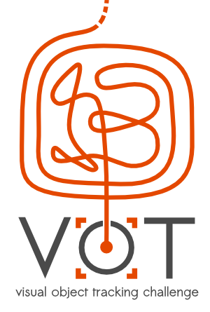

# VOT2013 Benchmark

<i class="glyphicon glyphicon-info-sign hugeicon"></i> 

<h4>The VOT2013 challenge has ended</h4>

It is still possible to use the benchmark to evaluate your tracker and compare it to the official results using the challenge ranking methodology. For more information on how to do this look at the [list of tutorials](/howto/). You can download raw data for comparison from the [results page](results.html).

<i class="glyphicon glyphicon-exclamation-sign hugeicon"></i> 

<h4>The VOT2013 benchmark is deprecated</h4>

The dataset and results are for the benchmark are still available for various purposes, but the benchmark is no longer supported. This means that we will not try to maintain toolkit compatibility with the benchmark so the results, obtained with newer toolkit versions may differ from the results reported in the paper. We also encourage everyone to use one of the newer VOT benchmarks for tracker evaluation.

Welcome to the official homepage of the VOT2013 benchmark. This benchmark was used in the VOT2013 challenge which is now over. The results were presented at a VOT2013 workshop on December 2nd, 2013 in Sydney, Australia in conjunction with [ICCV 2013](http://www.iccv2013.org/).  

## Supported by

