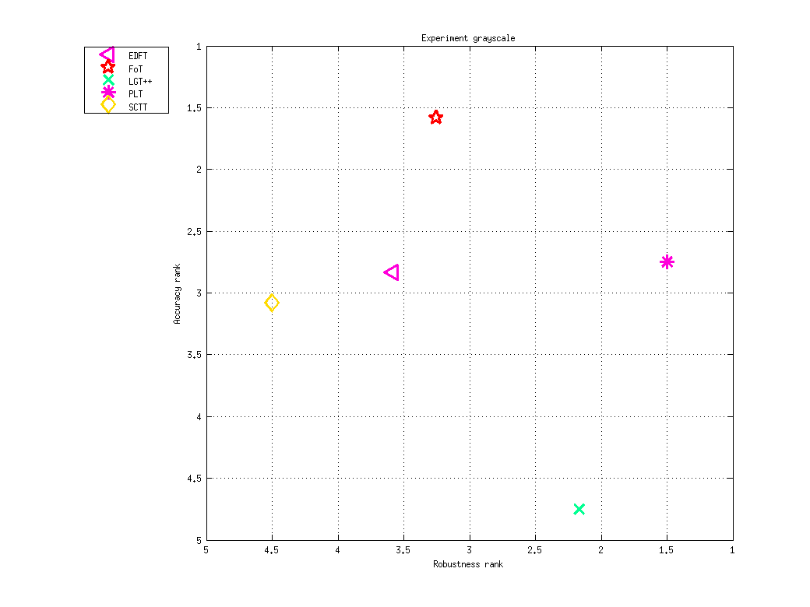

<h1 class="caption">Ranking report for experiment grayscale</h1>
<h2>Accuracy</h2>
<h3>Raw results</h3>

<table>
<tr><th>&nbsp;</th><th>FoT</th><th>PLT</th><th>EDFT</th><th>SCTT</th><th>LGT++</th></tr>
<tr><th>camera_motion</th><td>0.661 (0.218)</td><td>0.622 (0.202)</td><td>0.591 (0.23)</td><td>0.654 (0.224)</td><td>0.494 (0.193)</td></tr>
<tr><th>illum_change</th><td>0.772 (0.101)</td><td>0.618 (0.219)</td><td>0.646 (0.174)</td><td>0.588 (0.239)</td><td>0.456 (0.152)</td></tr>
<tr><th>occlusion</th><td>0.644 (0.225)</td><td>0.721 (0.182)</td><td>0.69 (0.228)</td><td>0.674 (0.225)</td><td>0.447 (0.152)</td></tr>
<tr><th>size</th><td>0.558 (0.24)</td><td>0.447 (0.196)</td><td>0.415 (0.237)</td><td>0.525 (0.261)</td><td>0.416 (0.197)</td></tr>
<tr><th>motion</th><td>0.704 (0.197)</td><td>0.621 (0.19)</td><td>0.625 (0.219)</td><td>0.605 (0.252)</td><td>0.57 (0.167)</td></tr>
<tr><th>empty</th><td>0.696 (0.203)</td><td>0.709 (0.258)</td><td>0.7 (0.263)</td><td>0.652 (0.284)</td><td>0.631 (0.0853)</td></tr>
</table>

<h3>Ranks</h3>

<table>
<tr><th>&nbsp;</th><th>FoT</th><th>PLT</th><th>EDFT</th><th>SCTT</th><th>LGT++</th></tr>
<tr><th>camera_motion</th><td>1</td><td>3</td><td>4</td><td>2</td><td>5</td></tr>
<tr><th>illum_change</th><td>1</td><td>3.5</td><td>2</td><td>3.5</td><td>5</td></tr>
<tr><th>occlusion</th><td>3.5</td><td>1</td><td>2.5</td><td>3</td><td>5</td></tr>
<tr><th>size</th><td>1</td><td>4</td><td>4</td><td>2</td><td>4</td></tr>
<tr><th>motion</th><td>1</td><td>3</td><td>2.5</td><td>3.5</td><td>5</td></tr>
<tr><th>empty</th><td>2</td><td>2</td><td>2</td><td>4.5</td><td>4.5</td></tr>
<tr><th><em>Average</em></th><td>1.58</td><td>2.75</td><td>2.83</td><td>3.08</td><td>4.75</td></tr>
</table>

<h2>Robustness</h2>
<h3>Raw results</h3>

<table>
<tr><th>&nbsp;</th><th>PLT</th><th>LGT++</th><th>FoT</th><th>EDFT</th><th>SCTT</th></tr>
<tr><th>camera_motion</th><td>0.333 (0.852)</td><td>0.561 (0.86)</td><td>1.25 (1.54)</td><td>1.33 (1.6)</td><td>2.83 (2.92)</td></tr>
<tr><th>illum_change</th><td>0 (0)</td><td>0 (0)</td><td>0 (0)</td><td>0.333 (0.477)</td><td>1 (0.826)</td></tr>
<tr><th>occlusion</th><td>0 (0)</td><td>0.256 (0.696)</td><td>0.667 (1.11)</td><td>0.833 (1.07)</td><td>1.33 (2.57)</td></tr>
<tr><th>size</th><td>0 (0)</td><td>0.325 (0.505)</td><td>0.875 (1.06)</td><td>0.625 (0.861)</td><td>1.75 (1.65)</td></tr>
<tr><th>motion</th><td>0.0769 (0.267)</td><td>0.185 (0.415)</td><td>0.615 (1.01)</td><td>0.538 (0.932)</td><td>1.54 (1.5)</td></tr>
<tr><th>empty</th><td>0 (0)</td><td>0 (0)</td><td>0 (0)</td><td>0 (0)</td><td>0 (0)</td></tr>
</table>

<h3>Ranks</h3>

<table>
<tr><th>&nbsp;</th><th>PLT</th><th>LGT++</th><th>FoT</th><th>EDFT</th><th>SCTT</th></tr>
<tr><th>camera_motion</th><td>1</td><td>2</td><td>3.5</td><td>3.5</td><td>5</td></tr>
<tr><th>illum_change</th><td>2</td><td>2</td><td>2</td><td>4</td><td>5</td></tr>
<tr><th>occlusion</th><td>1</td><td>2</td><td>4</td><td>4</td><td>4</td></tr>
<tr><th>size</th><td>1</td><td>2</td><td>3.5</td><td>3.5</td><td>5</td></tr>
<tr><th>motion</th><td>1</td><td>2</td><td>3.5</td><td>3.5</td><td>5</td></tr>
<tr><th>empty</th><td>3</td><td>3</td><td>3</td><td>3</td><td>3</td></tr>
<tr><th><em>Average</em></th><td>1.5</td><td>2.17</td><td>3.25</td><td>3.58</td><td>4.5</td></tr>
</table>

<h2>Combined ranking (weight = 0.5)</h2>

<table>
<tr><th>PLT</th><th>FoT</th><th>EDFT</th><th>LGT++</th><th>SCTT</th></tr>
<tr><td>2.12</td><td>2.42</td><td>3.21</td><td>3.46</td><td>3.79</td></tr>
</table>

Ranking AR-plot for grayscale

Generated on 2013-12-17 15:43:59

