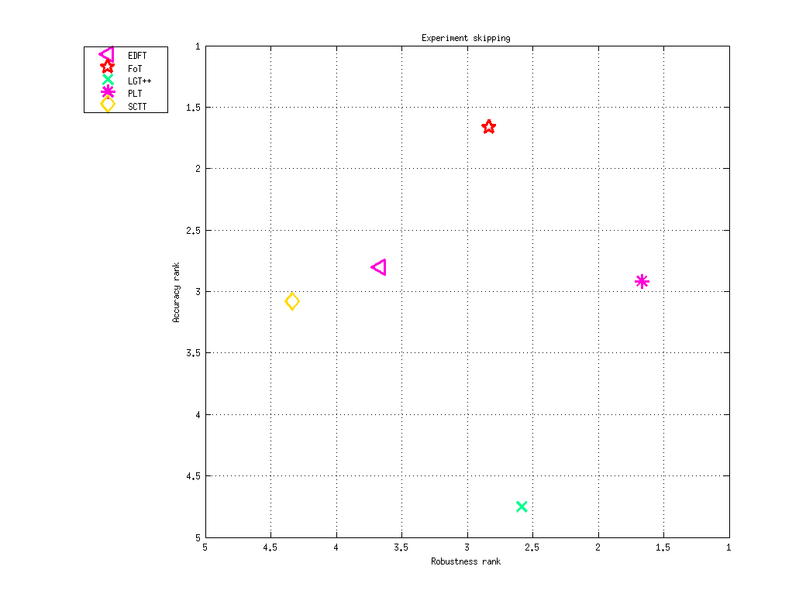

<h1 class="caption">Ranking report for experiment skipping</h1>
<h2>Accuracy</h2>
<h3>Raw results</h3>

<table>
<tr><th>&nbsp;</th><th>FoT</th><th>EDFT</th><th>PLT</th><th>SCTT</th><th>LGT++</th></tr>
<tr><th>camera_motion</th><td>0.665 (0.21)</td><td>0.614 (0.228)</td><td>0.597 (0.218)</td><td>0.601 (0.255)</td><td>0.478 (0.148)</td></tr>
<tr><th>illum_change</th><td>0.726 (0.136)</td><td>0.626 (0.169)</td><td>0.613 (0.221)</td><td>0.586 (0.271)</td><td>0.506 (0.108)</td></tr>
<tr><th>occlusion</th><td>0.689 (0.179)</td><td>0.764 (0.187)</td><td>0.749 (0.142)</td><td>0.667 (0.241)</td><td>0.412 (0.143)</td></tr>
<tr><th>size</th><td>0.552 (0.246)</td><td>0.375 (0.222)</td><td>0.442 (0.194)</td><td>0.526 (0.256)</td><td>0.419 (0.144)</td></tr>
<tr><th>motion</th><td>0.679 (0.203)</td><td>0.633 (0.226)</td><td>0.607 (0.192)</td><td>0.538 (0.274)</td><td>0.494 (0.163)</td></tr>
<tr><th>empty</th><td>0.697 (0.18)</td><td>0.707 (0.274)</td><td>0.678 (0.269)</td><td>0.655 (0.271)</td><td>0.55 (0.0841)</td></tr>
</table>

<h3>Ranks</h3>

<table>
<tr><th>&nbsp;</th><th>FoT</th><th>EDFT</th><th>PLT</th><th>SCTT</th><th>LGT++</th></tr>
<tr><th>camera_motion</th><td>1</td><td>3</td><td>3</td><td>3.5</td><td>5</td></tr>
<tr><th>illum_change</th><td>1</td><td>3</td><td>3.5</td><td>3</td><td>5</td></tr>
<tr><th>occlusion</th><td>3.5</td><td>1</td><td>2</td><td>3.5</td><td>5</td></tr>
<tr><th>size</th><td>1</td><td>5</td><td>3.5</td><td>2</td><td>3.5</td></tr>
<tr><th>motion</th><td>1</td><td>2.5</td><td>2.5</td><td>4</td><td>5</td></tr>
<tr><th>empty</th><td>2.5</td><td>2.33</td><td>3</td><td>2.5</td><td>5</td></tr>
<tr><th><em>Average</em></th><td>1.67</td><td>2.81</td><td>2.92</td><td>3.08</td><td>4.75</td></tr>
</table>

<h2>Robustness</h2>
<h3>Raw results</h3>

<table>
<tr><th>&nbsp;</th><th>PLT</th><th>LGT++</th><th>FoT</th><th>EDFT</th><th>SCTT</th></tr>
<tr><th>camera_motion</th><td>0.417 (0.864)</td><td>1.38 (2.18)</td><td>1.25 (1.64)</td><td>1.75 (2.05)</td><td>3.83 (3.47)</td></tr>
<tr><th>illum_change</th><td>1 (1.43)</td><td>1.91 (2.77)</td><td>1.33 (1.91)</td><td>1.33 (1.91)</td><td>2.33 (2.08)</td></tr>
<tr><th>occlusion</th><td>0.167 (0.375)</td><td>0.189 (0.421)</td><td>0.333 (0.474)</td><td>0.5 (0.503)</td><td>1.17 (2.2)</td></tr>
<tr><th>size</th><td>0.125 (0.332)</td><td>0.717 (1.37)</td><td>0.875 (1.62)</td><td>1.62 (1.94)</td><td>1.38 (1.87)</td></tr>
<tr><th>motion</th><td>0.462 (0.845)</td><td>1.51 (2.28)</td><td>1.23 (1.85)</td><td>1.54 (2.07)</td><td>3.31 (3.65)</td></tr>
<tr><th>empty</th><td>0 (0)</td><td>0 (0)</td><td>0 (0)</td><td>0 (0)</td><td>0 (0)</td></tr>
</table>

<h3>Ranks</h3>

<table>
<tr><th>&nbsp;</th><th>PLT</th><th>LGT++</th><th>FoT</th><th>EDFT</th><th>SCTT</th></tr>
<tr><th>camera_motion</th><td>1</td><td>2.5</td><td>2.5</td><td>4</td><td>5</td></tr>
<tr><th>illum_change</th><td>2.5</td><td>3</td><td>2.5</td><td>2.5</td><td>4.5</td></tr>
<tr><th>occlusion</th><td>1.5</td><td>1.5</td><td>4</td><td>4.5</td><td>4</td></tr>
<tr><th>size</th><td>1</td><td>2.5</td><td>2.5</td><td>4.5</td><td>4.5</td></tr>
<tr><th>motion</th><td>1</td><td>3</td><td>2.5</td><td>3.5</td><td>5</td></tr>
<tr><th>empty</th><td>3</td><td>3</td><td>3</td><td>3</td><td>3</td></tr>
<tr><th><em>Average</em></th><td>1.67</td><td>2.58</td><td>2.83</td><td>3.67</td><td>4.33</td></tr>
</table>

<h2>Combined ranking (weight = 0.5)</h2>

<table>
<tr><th>FoT</th><th>PLT</th><th>EDFT</th><th>LGT++</th><th>SCTT</th></tr>
<tr><td>2.25</td><td>2.29</td><td>3.24</td><td>3.67</td><td>3.71</td></tr>
</table>

Ranking AR-plot for skipping

Generated on 2013-12-17 15:44:20

