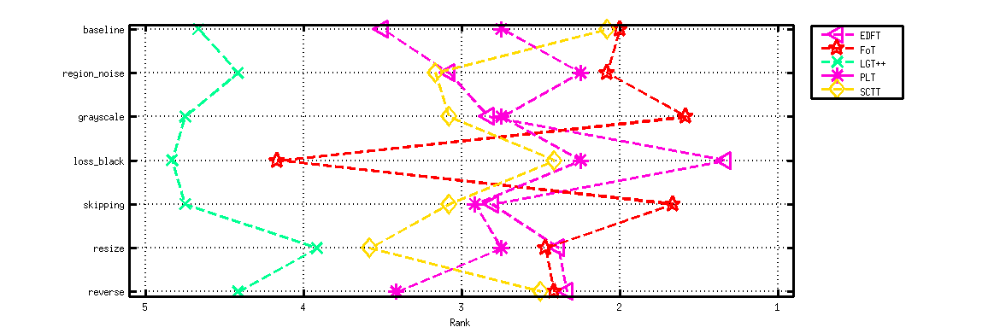
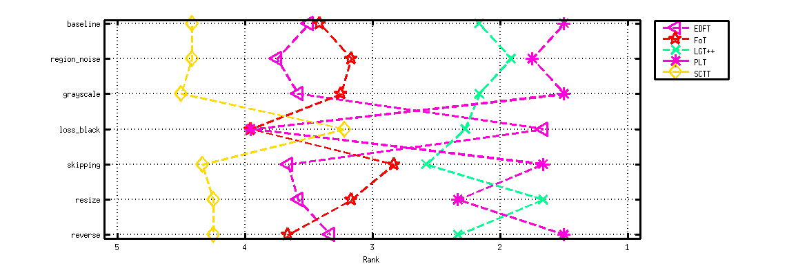
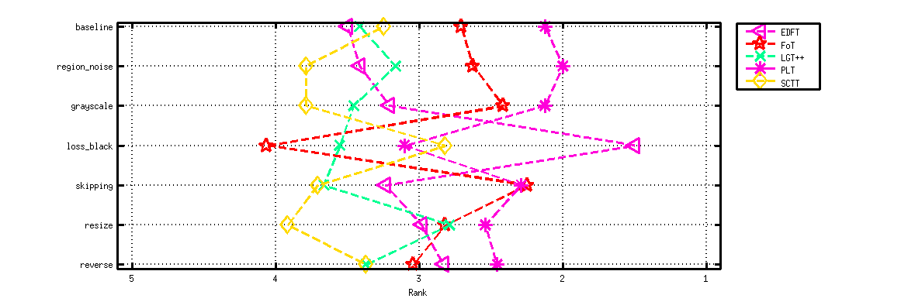

<h1 class="caption">Ranking report</h1>
<h2>Experiment baseline</h2>

<table>
<tr><th>PLT</th><th>FoT</th><th>SCTT</th><th>LGT++</th><th>EDFT</th></tr>
<tr><td>2.12</td><td>2.71</td><td>3.25</td><td>3.42</td><td>3.5</td></tr>
</table>

<a href="extra_ranking-baseline.html" class="more">More information</a>
<h2>Experiment region_noise</h2>

<table>
<tr><th>PLT</th><th>FoT</th><th>LGT++</th><th>EDFT</th><th>SCTT</th></tr>
<tr><td>2</td><td>2.62</td><td>3.17</td><td>3.42</td><td>3.79</td></tr>
</table>

<a href="extra_ranking-region_noise.html" class="more">More information</a>
<h2>Experiment grayscale</h2>

<table>
<tr><th>PLT</th><th>FoT</th><th>EDFT</th><th>LGT++</th><th>SCTT</th></tr>
<tr><td>2.12</td><td>2.42</td><td>3.21</td><td>3.46</td><td>3.79</td></tr>
</table>

<a href="extra_ranking-grayscale.html" class="more">More information</a>
<h2>Experiment loss_black</h2>

<table>
<tr><th>EDFT</th><th>SCTT</th><th>PLT</th><th>LGT++</th><th>FoT</th></tr>
<tr><td>1.5</td><td>2.82</td><td>3.1</td><td>3.56</td><td>4.06</td></tr>
</table>

<a href="extra_ranking-loss_black.html" class="more">More information</a>
<h2>Experiment skipping</h2>

<table>
<tr><th>FoT</th><th>PLT</th><th>EDFT</th><th>LGT++</th><th>SCTT</th></tr>
<tr><td>2.25</td><td>2.29</td><td>3.24</td><td>3.67</td><td>3.71</td></tr>
</table>

<a href="extra_ranking-skipping.html" class="more">More information</a>
<h2>Experiment resize</h2>

<table>
<tr><th>PLT</th><th>LGT++</th><th>FoT</th><th>EDFT</th><th>SCTT</th></tr>
<tr><td>2.54</td><td>2.79</td><td>2.82</td><td>2.99</td><td>3.92</td></tr>
</table>

<a href="extra_ranking-resize.html" class="more">More information</a>
<h2>Experiment reverse</h2>

<table>
<tr><th>PLT</th><th>EDFT</th><th>FoT</th><th>LGT++</th><th>SCTT</th></tr>
<tr><td>2.46</td><td>2.83</td><td>3.04</td><td>3.38</td><td>3.38</td></tr>
</table>

<a href="extra_ranking-reverse.html" class="more">More information</a>
<h2>Averaged</h2>

<table>
<tr><th>PLT</th><th>FoT</th><th>EDFT</th><th>LGT++</th><th>SCTT</th></tr>
<tr><td>2.38</td><td>2.85</td><td>2.95</td><td>3.35</td><td>3.52</td></tr>
</table>

<h2>Ranking permutations</h2>

Ranking permutations for accuracy rank

Ranking permutations for robustness rank

Ranking permutations for combined rank

Generated on 2013-12-17 15:44:45

