# About the VOT 2014 dataset

The dataset comprises 25 short sequences showing various objects in challenging backgrounds. Eight sequences are from last year's VOT2013 challenge (bolt, bicycle, david, diving, gymnastics, hand, sunshade, woman). The new sequences show complementary objects and backgrounds, for example a fish underwater or a surfer riding a big wave.

The sequences were chosen from a large pool of sequences including the [ALOV dataset](http://www.alov300.org/) using a methodology based on clustering visual features of object and background so that those 25 sequences sample evenly well the existing pool.

The sequences were annotated by the VOT committee using rotated bounding boxes in order to provide highly accurate ground truth values for comparing results.

The dataset is automatically downloaded by the evaluation kit during the install process; there is no need to separately download the sequences for the challenge. If you are solely interested in the sequences, please download the [dataset](http://box.vicos.si/vot/vot2014.zip). The compressed file contains the single images of each sequence and per frame labels of the rotated bounding box marking the object. The labels are stored in a text file with the format:

	frameN: X1, Y1, X2, Y2, X3, Y3, X4, Y4
	
where `Xi` and `Yi` are the coordinates of corner `i` of the bounding box in frame `N`, the N-th row in the text file.

The following images give an overview of the dataset:

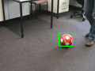
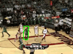

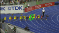
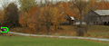

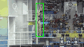
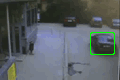
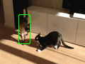
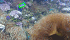
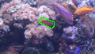
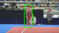
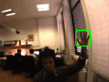
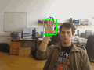
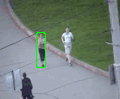
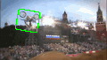
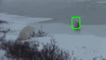
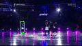
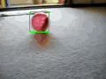
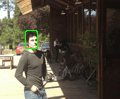
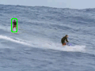
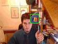
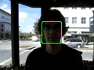
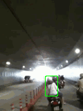
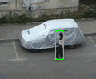

