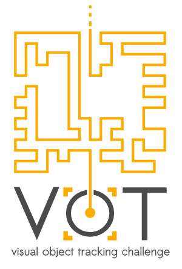

# VOT2014 Benchmark

<i class="glyphicon glyphicon-info-sign hugeicon"></i> 

<h4>The VOT2014 challenge has ended</h4>

It is still possible to use the benchmark to evaluate your tracker and compare it to the official results using the challenge ranking methodology. For more information on how to do this look at the [list of tutorials](/howto/index.html).

<i class="glyphicon glyphicon-exclamation-sign hugeicon"></i> 

<h4>The VOT2014 benchmark is deprecated</h4>

The dataset and results are for the benchmark are still available for various purposes, but the benchmark is no longer supported. This means that we will not try to maintain toolkit compatibility with the benchmark so the results, obtained with newer toolkit versions may differ from the results reported in the paper. We also encourage everyone to use one of the newer VOT benchmarks for tracker evaluation.

Welcome to the official homepage of the VOT2014 benchmark. This benchmark was used in the VOT2014 challenge which is now over. The results were presented at a VOT2014 workshop on September 6th, 2014 in Zurich, Switzerland in conjunction with [ECCV 2014](http://www.eccv2014.org/).  

## VOT2014 highlights
- An improved version of the cross-platform evaluation kit, which executes the experiments much faster thanks to a powerful new communication protocol between kit and tracker
- The dataset was enriched with new videos (in total 25 sequences) and labelled with rotating bounding boxes rather than axis-aligned ones
- The dataset is per-frame labelled with attributes
- All the participants who submitted results that exceeded a reasonable threshold on performance automatically became co-authors of the joint paper that was published in the workshop proceedings
- Participants are encouraged to submit their own workshop papers
- A prize was awarded to the best-performing tracking team

## Sponsors

The VOT2014 award and the VOT t-shirts were sponsored by the Faculty of Computer and Information Science, University of Ljubljana.

