## VOT2015 Dataset

The dataset comprises 60 short sequences showing various objects in challenging backgrounds. 
The sequences were chosen from a large pool of sequences including the [ALOV dataset](www.alov300.org/), OTB2 dataset, non-tracking datasets, [Computer Vision Online](http://www.computervisiononline.com/datasets), [Professor Bob Fisher's Image Database](http://homepages.inf.ed.ac.uk/rbf/CVonline/Imagedbase.htm), [Videezy](http://www.videezy.com/), [Center for Research in Computer Vision, University of Central Florida, USA](http://crcv.ucf.edu/data/), [NYU Center for Genomics and Systems Biology](http://celltracking.bio.nyu.edu/), [Data Wrangling](http://www.datawrangling.com/some-datasets-available-on-the-web/), [Open Access Directory](http://oad.simmons.edu/oadwiki/Data_repositories) and [Learning and Recognition in Vision Group, INRIA, France](http://lear.inrialpes.fr/data). The VOT sequence selection protocol was applied to obtain a representative set of challenging sequences.

### Annotations

The sequences were annotated by the VOT committee using rotated bounding boxes in order to provide highly accurate ground truth values for comparing results.

The dataset is automatically downloaded by the evaluation kit when needed, there is no need to separately download the sequences for the challenge. If you are solely interested in the sequences, please download the [dataset](http://box.vicos.si/vot/vot2015.zip). The compressed archive contains directories of images for each sequence and per frame annotations of the rotated bounding box marking the object. The annotations are stored in a text file with the format:

	frameN: X1, Y1, X2, Y2, X3, Y3, X4, Y4
	
where `Xi` and `Yi` are the coordinates of corner `i` of the bounding box in frame `N`, the N-th row in the text file.

### Overview

The following gallery gives an overview of the dataset (hover over image to see several snapshots from the sequence).

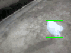

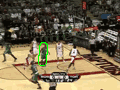
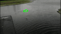
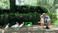
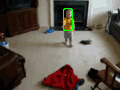

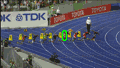
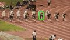
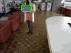

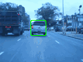
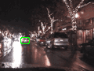

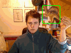
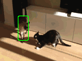
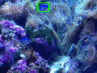
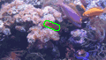
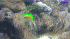
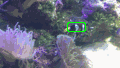
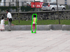
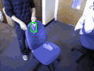
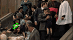
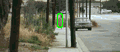
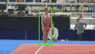
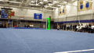
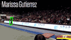
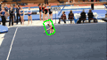
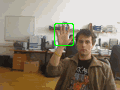
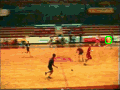
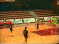
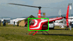

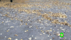
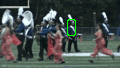
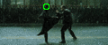
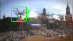

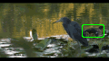
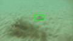
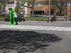
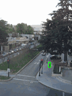
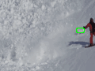
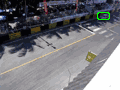
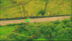

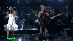
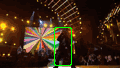
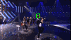
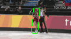
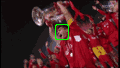
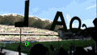
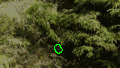
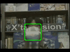
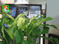
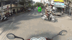
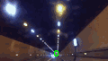

## VOT-TIR2015 Dataset

The VOT-TIR dataset consists of 20 sequences of which eight has been recorded specifically for this dataset. The other twelve sequences have been collected from different sources including Termisk Systemteknik AB, the Department of Electrical Engineering at Link&ouml;ping University, the School of Mechanical Engineering at University of Birmingham, ETH Z&uuml;rich, Fraunhofer IOSB, Aalborg University, and finally the EU FP7 project P5.

The raw signal values from a thermal infrared sensor is typically stored in 16bits. Since not all trackers can handle 16-bit data and for the purpose of visualisation, all sequences in the dataset have been truncated to 8-bit. In practice, this is a common procedure since not all sensors give access to the 16-bit values. Therefore, the sequences are not radiometric (the corresponding temperature value is unknown) and the dynamic may adaptively change during the course of a sequence.

### Annotations

Annotations have been performed in accordance with the VOT2013 annotation procedure. That is, there are no rotating bounding boxes, all of them are axis-aligned. The annotations are stored in a text file with the format:

	frameN: left, top, width, height

Regading local, per-frame, annotations, the label illumination change has been replaced with the label dynamics change since there are no illumination changes in VOT-TIR2015. Instead, there may be dynamic changes in some sequences due to the 16-bit to 8-bit conversion described above.

### Overview

The following gallery gives an overview of the dataset (hover over image to see several snapshots from the sequence).

TODO

