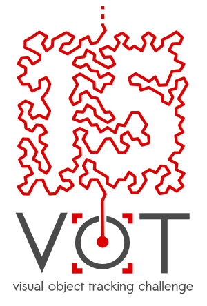

# VOT2015 Challenge

The VOT challenges provide the tracking community with a precisely defined and repeatable way of comparing short-term trackers as well as a common platform for discussing the evaluation and advancements made in the field of visual tracking.

Following two highly successful VOT challenges [VOT2013](/vot2013/) ([ICCV 2013](http://www.iccv2013.org/)) and [VOT2014](/vot2014/) ([ECCV2014](http://eccv2014.org/)), we are happy to announce the 3rd Visual Object Tracking Challenge VOT2015 to be held in conjunction with the [ICCV2015](http://pamitc.org/iccv15/). Researchers from industry as well as academia are invited to participate. Similarly to VOT2013 and VOT2014, the challenge aims at single-object short-term trackers that do not apply pre-learned models of object appearance (model-free). Trackers do not necessarily need to be capable of automatic re-initialization, as the objects are visible over the whole course of the sequences.

We are also announcing the first VOT thermal imagery tracking sub-challenge VOT-TIR2015. For convenience, the submission of the VOT2015 and the VOT-TIR2015 challenge is via a common submission system. The results of the VOT2015 and VOT-TIR2015 challenges will be presented at the ICCV2015 VOT workshop.

## Call for participation and for papers

The VOT committee invites you to participate by:

1. Entering one or both of the following challenges:
  * **VOT2015 challenge** - Visit the [participation page](participation.html) on running the VOT2015 experiments and submitting the results.
  * **VOT-TIR2015 challenge** - Visit the [participation page](participation.html) on running the VOT-TIR2015 experiments and submitting the results.

2. Submitting a full-length paper describing:
  * Original or improved trackers as well as papers giving new insights into existing trackers or class of trackers. See [participation page](participation.html) for details of the requirements for a tracking paper.
  * Novel ways of using and extending the VOT framework for tracker performance analysis.

Present your work at VOT2015 workshop:
 * All authors of accepted workshop papers will give either **poster or oral presentations** at the workshop.
 * The committee plans to invite the winners of the VOT2015 challenge and winners of the VOT-TIR2015 challenge as **invited speakers** to the workshop. 
 * Participants of the VOT2015 challenge can become **co-authors of the VOT2015 joint results paper**. See [participation page](participation.html) for more details.
 * Participants of the VOT-TIR2015 challenge can become **co-authors of the VOT-TIR2015 joint results paper**. See [participation page](participation.html) for more details.

## Important dates 

* Start of challenge: **25. July 2015**
* Paper submission deadline: ~~**1. September 2015**~~ -> **7. September 2015**
* Results submission deadline: **7. September 2015**
* Notification of paper acceptance: ~~**1. October 2015**~~ -> **5. October 2015**
* Camera ready: ~~**15. October 2015**~~ -> **14. October 2015**
* VOT2015 workshop: **12. December 2015**

## Highlights

1. New fully annotated [dataset](dataset.html) compiled with the VOT dataset construction methodology
2. New toolkit for fast experiments execution with tutorials
3. New sub-challenge VOT-TIR

