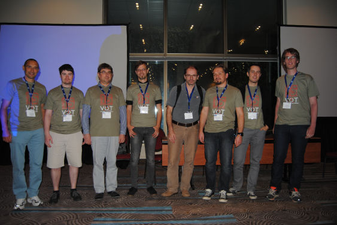

# VOT2015 Benchmark

<i class="glyphicon glyphicon-info-sign hugeicon"></i> 

<h4>The VOT2015 challenge has ended</h4>

It is still possible to use the benchmark to evaluate your tracker and compare it to the official results using the challenge ranking methodology. For more information on how to do this look at the [list of tutorials](/howto/index.html).

Welcome to the official homepage of the VOT2015 benchmark. This benchmark was used in the VOT2015 challenge which is now over. The results were presented at a VOT2015 workshop on December 12th, 2015 in Santiago de Chile, Chile in conjunction with [ICCV 2015](http://pamitc.org/iccv15/).  

## VOT2015 highlights
- In addition to the VOT Challenge we also organised the first VOT thermal imagery tracking sub-challenge VOT-TIR2015
- An improved version of the cross-platform evaluation kit, which executes the experiments much faster thanks to a powerful new communication protocol between kit and tracker
- The dataset was enriched with new videos (in total 60 sequences in the VOT Challenge and 20 sequences in the VOT-TIR Challenge) and bounding boxes labelled
- The dataset is per-frame labelled with attributes
- All the participants who submitted results that exceeded a reasonable threshold on performance automatically became co-authors of the joint paper that was published in the workshop proceedings
- Participants are encouraged to submit their own workshop papers
- A prize was awarded to the best-performing tracking team on each challenge

## Sponsors

The VOT2015 award and the VOT t-shirts were sponsored by the Faculty of Computer and Information Science, University of Ljubljana.

