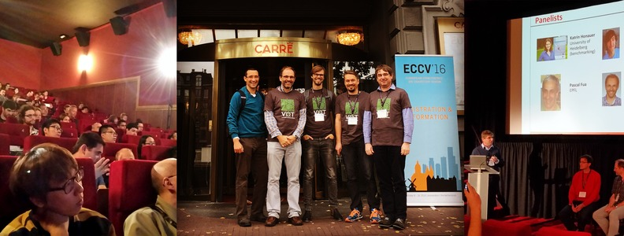

# VOT2016 Benchmark

<i class="glyphicon glyphicon-info-sign hugeicon"></i> 

<h4>The VOT2016 challenge has ended</h4>

It is still possible to use the benchmark to evaluate your tracker and compare it to the official results using the challenge ranking methodology. For more information on how to do this look at the [list of tutorials](/howto/index.html).

Welcome to the official homepage of the VOT2016 benchmark. This benchmark was used in the VOT2016 challenge which is now over. The results were presented at a VOT2016 workshop on October 10th, 2016 in Amsterdam, Netherlands in conjunction with [ECCV 2016](http://www.eccv2016.org).  

## VOT2016 highlights
- In addition to the VOT Challenge we also organised the first VOT thermal imagery tracking sub-challenge VOT-TIR2016
- A new improved version of the cross-platform evaluation kit
- The VOT2015 dataset was re-annotated
- All the participants who submitted results that exceeded a reasonable threshold on performance automatically became co-authors of the joint paper that was published in the workshop proceedings
- Participants are encouraged to submit their own workshop papers
- A prize was awarded to the best-performing tracking team on each challenge

## Sponsors

The VOT2016 award and the VOT t-shirts were sponsored by the Faculty of Computer and Information Science, University of Ljubljana.

