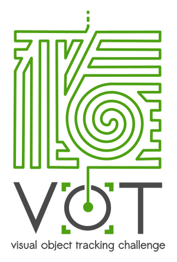

# VOT2016 Challenge

## News and updates

### July 14th, 2016: - Workshop day

The **VOT workshop** will be held on October 10th. 

You find the old news 
<a href="http://www.votchallenge.net/vot2016/index.html#old_news">here</a>.

## Call for participation and for papers
We are happy to announce the 4th VOT Workshop, that will take place in conjunction with ECCV 2016.
The event follows the three highly sucessful workshops VOT2013 (ICCV2013), VOT2014 (ECCV2014), and VOT2015 (ICCV2015).

Researchers from industry as well as academia are invited to participate. The challenge aims at **single-object short-term trackers** that do not apply pre-learned models of object appearance (**model-free**). Trackers do not necessarily need to be capable of automatic re-initialization, as the objects are visible over the whole course of the sequences.

We are also announcing the second VOT thermal imagery tracking sub-challenge VOT-TIR2016. The details of the VOT2016 and VOT-TIR2016 sub-challenge will be available soon.

The results of the VOT2016 and VOT-TIR2016 challenges will be presented at the ECCV2016 VOT workshop.

The VOT committee also solicits full-length papers describing:

 * Original or improved trackers as well as papers giving new insights into existing trackers or class of trackers. See [participation page](/vot2016/participation.html) for details of the requirements for a tracking paper.
 * Novel ways of using and extending the VOT framework for tracker performance analysis.
 * We will consider papers rejected at ECCV2016 and ICPR2016, accompanied with   
 (i) a cover letter describing the difference between ECCV and VOT submissions,   
 (ii) the reviews, and   
 (iii) authors' comments explaining how the paper was improved.   
 Please provide aforementioned material ((i)-(iii)) as supplemental material in one pdf file.

## How to participate at VOT2016?

 * Visit the [participation page](/vot2016/participation.html) on running the VOT2016 experiments.
 * Visit the [participation page](/vot2016/participation.html) on running the VOT-TIR2016 experiments.

## Important dates

VOT-TIR2016 Data available: ~~May 13th 2016~~ -> May 16th 2016  
VOT2016 Data available: ~~May 13th 2016~~ -> May 25th 2016  
Paper Submission (standard): ~~June 16th 2016~~ -> June 20th 2016 (23:59:59, CET)  
Results submission deadline: ~~June 17th 2016~~ -> June 20th 2016 (23:59:59, CET)  
Full Paper Submission (Revised ECCV2016 and ICPR2016 rejected papers): ~~July 7th 2016~~ -> ~~July 11th 2016~~ -> July 18th 2016 (23:59:59, CET)  
Notification of Acceptance: ~~July 11th 2016~~ -> ~~July 12th 2016~~ -> July 21st 2016 (23:59:59, CET)  
Camera-Ready Paper Due: ~~July 24th 2016~~ -> August 25th 2016 (23:59:59, CET)  
Workshop: October 10th 2016  

## Old news 

### June 30th, 2016: - Extension of full paper submission deadline

The **full paper submission deadline** has been extended to **18.07.2016**. 
For more information, please check the 
<a href="http://www.votchallenge.net/vot2016/index.html#important_dates">important dates</a> section.

### June 16th, 2016 - Information about GT

A question was raised about the ground truth bounding boxes on the VOT forum. In some cases the 
corners of rotated bounding boxes extend outside of the image. But we also noticed that in two 
frames in the matrix sequence the bounding box extends out of image disproportionately the part 
that is in the image boundaries is till correct, though.

The out-of-image-bounds bounding boxes do not affect performance evaluation, since overlaps are 
computed only within image regions. But these may cause failures if your tracker does not handle 
them properly during initialization. We thus urge you to perform boundary checks in your own 
code at tracker initialization.

### June 10th, 2016: - Extension of results deadline</a>

Due to the recent VOT2016 toolkit update, the **results submission deadline** has been extended 
to **20.06.2016**.

### June 9th, 2016: Important notice - VOT2016 toolkit update</a>

Due to the improper overlap computation in the VOT2016 toolkit (introduced in version 12.5.2016), 
please update the toolkit and rerun the VOT2016 experiments if you used a version earlier than June 9th, 2016.
Only results obtained by the updated VOT toolkit (downloaded after June 9th, 2016) will be considered in the 
challenge.
