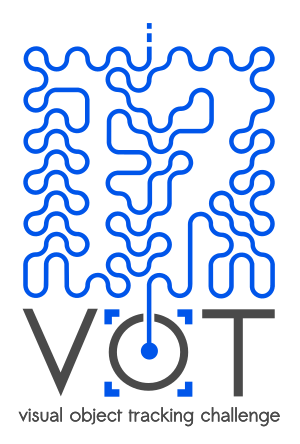

# VOT2017 Challenge

The VOT challenges provide the tracking community with a precisely defined and repeatable way of comparing short-term trackers as well as a common platform for discussing the evaluation and advancements made in the field of visual tracking.

Following four highly successful VOT challenges, we are happy to announce the 5th Visual Object Tracking Challenge VOT2017 that will be held in conjunction with the [ICCV2017](http://iccv2017.thecvf.com/).

Researchers from industry as well as academia are invited to participate. The challenge aims at **single-object short-term trackers** that do not apply pre-learned models of object appearance (**model-free**). Trackers do not necessarily need to be capable of automatic re-initialization, as the objects are visible over the whole course of the sequences.

### Highlights

 * Updated dataset
 * Realtime experiment
 * Full transition to TraX protocol
 * Winner will be determined on a sequestered dataset

### Participate by

 * Run your tracker on VOT2017 challenge and submit the results. The joint results of the VOT2017 challenge will be presented at the VOT2017 workshop.
 * Run your tracker on VOT-TIR2017 challenge (which is the VOT-TIR2016 reopened) and submit the results.
 * Submit (and present) a research paper on visual tracking at the VOT2017 workshop.

Visit the [participation page](/vot2017/participation.html) for detailed information on how to participate.

### Important dates

This is a tentative list of important dates for VOT2017:

 * Data available: May 8th 2017
 * Paper Submission: June 16th 2017
 * Results submission deadline: June 19th 2017 (12.00 AM CET - noon)
 * Notification of Acceptance: July 11th 2017
 * Camera-Ready Paper Due: August 20th 2017
 * Workshop: October 28th 2017 (Half day, AM)

