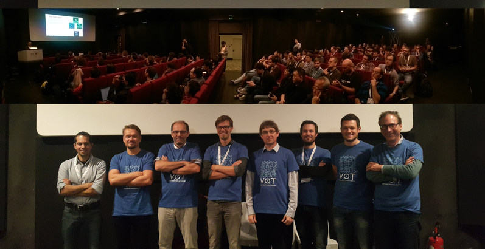

# VOT2017 Benchmark

<i class="glyphicon glyphicon-info-sign hugeicon"></i> 

<h4>The VOT2017 challenge has ended</h4>

It is still possible to use the benchmark to evaluate your tracker and compare it to the official results using the challenge ranking methodology. For more information on how to do this look at the [list of tutorials](/howto/index.html).

Welcome to the official homepage of the VOT2017 benchmark. This benchmark was used in the VOT2017 challenge which is now over. The results were presented at a VOT2017 workshop on October 28th, 2017 in Venice, Italy in conjunction with [ICCV2017](http://iccv2017.thecvf.com/).

### VOT2017 Highlights

 * Updated dataset
 * Realtime experiment
 * Full transition to TraX protocol
 * Winner will be determined on a sequestered dataset

## Sponsors

The VOT2017 workshop was sposored by the Faculty of Computer and Information Science, University of Ljubljana and SICK.

