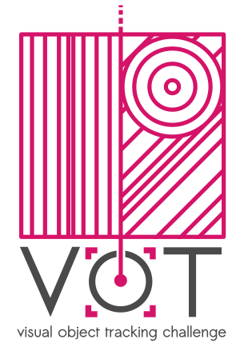

# VOT2019 Challenge

<i class="glyphicon glyphicon-info-sign hugeicon"></i> 

<h4>Paper submission deadline extended to 30.6.2019</h4>
The VOT2019 paper submission deadline has been extended to 30.6.2019 (24:00 CET - midnight).

<i class="glyphicon glyphicon-info-sign hugeicon"></i> 

<h4>VOT-RGBT-annotation update</h4>
Due to the semi-automatic annotation process, some few frames had slightly inaccurate bounding boxes and in some few cases, one coordinate of the bonding box was placed outside the image. In order to avoid technical problems and inaccuracies in the evaluation, we decided to update the annotations. Please delete your local copy of the dataset on the disk and re-run the experiment (the toolkit will download the new dataset automatically). We apologize for potential extra work and hope to welcome you at the VOT-workshop!

The VOT challenges provide the tracking community with a precisely defined and repeatable way of comparing short-term trackers and long-term trackers as well as a common platform for discussing the evaluation and advancements made in the field of visual tracking. Following six highly successful VOT challenges, the 7th Visual Object Tracking Challenge VOT2019 workshop will be held in conjunction with the [ICCV2019](http://iccv2019.thecvf.com/).

## Highlights

* Two new challenges introduced (VOT-RGBT & VOT-RGBD)
* VOT-RGBT2019 challenge will evaluate trackers that use 4 channels (RGB + IR) in tracking.
* VOT-RGBD2019 challenge will evaluate trackers that use 4 channels (RGB + depth) in tracking.
* Updated VOT toolkit to support multi-channel inputs.
* Authors of well-performing trackers will be invited to coauthor the VOT2019 results papers.
* Authors of top-performing trackers will be invited to present their trackers at VOT2019 workshop.

## The VOT2019 Challenges

* VOT short-term tracking challenge VOT-ST2019 (same as in VOT2018) - Robust short-term tracking under appearance variation, occlusion and clutter.
* VOT short-term real-time challenge VOT-RT2019 (same as in VOT2018) - Robust short-term tracking under time constraints.
* VOT long-term tracking challenge VOT-LT2019 (same as in VOT2018) - Robust tracking with target disappearance.
* VOT thermal and infrared short-term tracking challenge VOT-RGBT2019 (NEW) - Multi-modality tracking under RGB and T partial modality de-synchronization.
* VOT color and depth long-term tracking challenge VOT-RGBD2019 (NEW) - Using depth to improve LT RGB tracking with target disappearance.

## Participation

* Run your tracker on one or more challenges and submit the results.
* Submit a tracking paper as a standard submission.
* Authors of high-quality tracking papers not accepted to ICCV due to, e.g., insufficient significance, can re-submit to VOT.

## Important dates

* Challenge open: April 15th 2019
* <strike>Results Submission: May 31st 2019 (24:00 CET - midnight) -> June 9th 2019 (24:00 CET - midnight)</strike>
* <strike>Paper Submission I (standard): June 14th 2019 -> June 30th 2019 (24:00 CET - midnight)</strike>
* <strike>Paper Submission II (high-quality tracking papers not accepted to ICCV): August 3rd 2019</strike>
* Notification: August 12th 2019
* Camera-ready: August 25th 2019
* Workshop: October 28th 2019

## Sponsors

The VOT2019 workshop was sposored by the Faculty of Computer and Information Science, University of Ljubljana.

