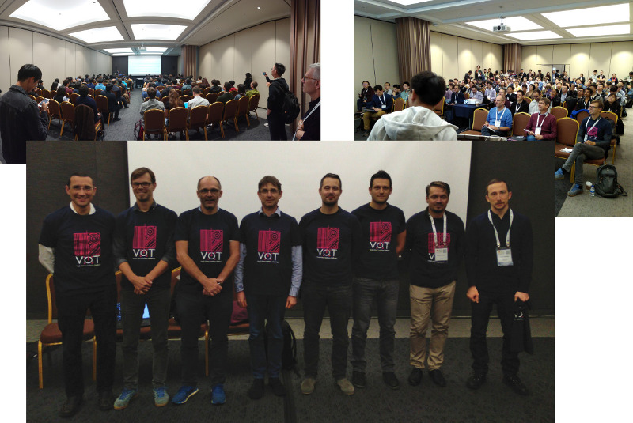

# VOT2019 Benchmark

<i class="glyphicon glyphicon-info-sign hugeicon"></i> 

<h4>The VOT2019 challenge has ended</h4>

It is still possible to use the benchmark to evaluate your tracker and compare it to the official results using the challenge ranking methodology. For more information on how to do this look at the [list of tutorials](/howto/index.html).

The VOT challenges provide the tracking community with a precisely defined and repeatable way of comparing short-term trackers and long-term trackers as well as a common platform for discussing the evaluation and advancements made in the field of visual tracking. Following six highly successful VOT challenges, the 7th Visual Object Tracking Challenge VOT2019 workshop will be held in conjunction with the [ICCV2019](http://iccv2019.thecvf.com/).

## Highlights

* Two new challenges introduced (VOT-RGBT & VOT-RGBD)
* VOT-RGBT2019 challenge will evaluate trackers that use 4 channels (RGB + IR) in tracking.
* VOT-RGBD2019 challenge will evaluate trackers that use 4 channels (RGB + depth) in tracking.
* Updated VOT toolkit to support multi-channel inputs.
* Authors of well-performing trackers will be invited to coauthor the VOT2019 results papers.
* Authors of top-performing trackers will be invited to present their trackers at VOT2019 workshop.

## The VOT2019 Challenges

* VOT short-term tracking challenge VOT-ST2019 (same as in VOT2018) - Robust short-term tracking under appearance variation, occlusion and clutter.
* VOT short-term real-time challenge VOT-RT2019 (same as in VOT2018) - Robust short-term tracking under time constraints.
* VOT long-term tracking challenge VOT-LT2019 (same as in VOT2018) - Robust tracking with target disappearance.
* VOT thermal and infrared short-term tracking challenge VOT-RGBT2019 (NEW) - Multi-modality tracking under RGB and T partial modality de-synchronization.
* VOT color and depth long-term tracking challenge VOT-RGBD2019 (NEW) - Using depth to improve LT RGB tracking with target disappearance.

## Sponsors

The VOT2019 workshop was sposored by the Faculty of Computer and Information Science, University of Ljubljana.

