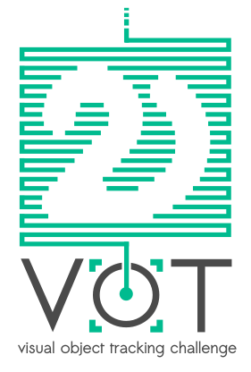

# VOT2020 Challenge

The VOT challenges provide the tracking community with a precisely defined and repeatable way of comparing short-term trackers and long-term trackers as well as a common platform for discussing the evaluation and advancements made in the field of visual tracking. Following seven highly successful VOT challenges, the 8th Visual Object Tracking Challenge VOT2020 and workshop will be held in conjunction with ECCV 2020.

Please see the [participation page](participation.html) for more details on how to attend the challenge.

<i class="glyphicon glyphicon-exclamation-sign hugeicon" ></i> 

Finally, and after lengthy lockdown-caused delays that we apologize for, the RGBT-challenge is now launched. Note that if you have tested your tracker prior to the launch using the old VOT2019 Matlab toolkit using the VOT-RGBT2019
challenge, you will have to switch to the new Python toolkit as the VOT-RGBT2020 dataset is only available there. Also note that the evaluation protocol has changed this year so the results obtained on VOT-RGBT2019 will change.

## Highlights

 * Five challenges planned
 * Toolkit re-implemented in Python
 * A new performance evaluation protocol introduced for short-term tracker evaluation - more information [here](https://data.votchallenge.net/vot2020/vot-2020-protocol.pdf)
 * 2020 datasets refreshed in VOT-ST challenge
 * Bounding boxes VOT-ST2020 & VOT-RT2020 will be replaced by segmentation masks (performance evaluated on segmentation)
 * Authors of well-performing trackers will be invited to coauthor the VOT2020 results papers.
 * Authors of top-performing trackers will be invited to present their trackers at VOT2020 workshop.

## Challenges

 * VOT short-term tracking challenge VOT-ST2020 - Robust short-term tracking under appearance variation, occlusion and clutter. Targets annotated by segmentation masks.
 * VOT short-term real-time challenge VOT-RT2020 - Robust short-term tracking under time constraints. Targets annotated by segmentation masks.
 * VOT long-term tracking challenge VOT-LT2020 - Robust tracking with target disappearance.
 * VOT thermal and infrared short-term tracking challenge VOT-RGBT2020 - Multi-modality tracking under RGB and T partial modality de-synchronization (challenge will be opened later).
 * VOT color and depth long-term tracking challenge VOT-RGBD2020 - Using depth to improve LT RGB tracking with target disappearance.

## Important dates

 * ~~Toolkit beta testing opens: early March 2020~~
 * ~~Challenge open: March 20th 2020~~
 * Results Submission: May 3rd 2020 (24:00 CET - midnight)
 * Paper Submission I (standard): May 31st 2020
 * Paper Submission II (high-quality tracking papers not accepted to ECCV): July 6th 2020
 * Notification (submitted papers): July 10th 2020
 * Camera-ready: July 17th 2020
 * Workshop: August 28th 2020

