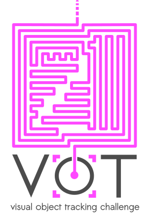

# VOT2021 Challenge

The VOT challenges provide the tracking community with a precisely defined and repeatable way of comparing short-term trackers and long-term trackers as well as a common platform for discussing the evaluation and advancements made in the field of visual tracking. 
Following eight highly successful VOT challenges, the 9th Visual Object Tracking Challenge VOT2021 and workshop will be held in conjunction with ICCV 2021.

## Timeline

 * 20th April: VOT2021 challenge opens
 * <strike>23th</strike> 31st May: Tracker results submission deadline (challenge ends)
 * 28th June: Winners of sub-challenges identified (but not publicly disclosed)
 * 30th June: Submission deadline for regular papers to VOT2021
 * 1st August: Submission deadline for the “high-quality tracking papers not accepted to ICCV2021 due to, e.g., insufficient significance, but having a great value to VOT community”
 * 4th August: Notification to authors of the contributed papers
 * 15th August: Camera ready deadline
 * 11th or 17th October <tba>: VOT2021 workshop in conjunction with the ICCV2021 (winners disclosed) (virtual event)

The tracking results should be submitted via the [submission page](https://submit.votchallenge.net/).
Contributed papers should be submitted via the cmt VOT page (TBA).
Please see further guidelines for attending the challenge and/or submitting a paper [here](participation.html).

<!--
## Sponsors

The VOT2020 workshop was sposored by the Faculty of Computer and Information Science, University of Ljubljana.

-->
