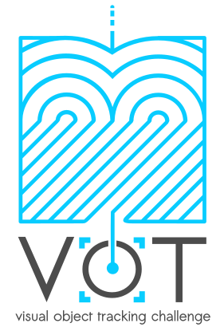

# VOT2022 Challenge

The VOT challenges provide the tracking community with a precisely defined and repeatable way of comparing short-term trackers and long-term trackers as well as a common platform for discussing the evaluation and advancements made in the field of visual tracking. Following nine highly successful VOT challenges, the 10th Visual Object Tracking Challenge VOT2022 will was held in spring of 2022. The results will be presented on 24.10.2022 as an ECCV2022 workshop.

## Challenges

 * VOT-STS2022 segmentation tracking challenge (short-term, input RGB, target localized by a segmentation mask)
 * VOT-RTS2022 segmentation tracking challenge (short-term, realtime, input RGB, target localized by a segmentation mask)
 * VOT-STB2022 bounding box tracking challenge (short-term, input RGB, target localized by a bounding box)
 * VOT-RTB2022 bounding box tracking challenge (short-term, realtime, input RGB, target localized by a bounding box)
 * VOT-RGBD2022 tracking challenge (short term, input RGB+depth, target localized by a bounding box)
 * VOT-D2022 tracking challenge (short term, input depth, target localized by a bounding box)
 * VOT-LT2022 tracking challenge (long term, input RGB, target localized by a bounding box)
 
## What's new
 * The VOT-STS2022 segmentation tracking challenge dataset refreshed
 * The bounding box tracking challenge re-introduced (VOT-STB2022). To facilitate development o bounding-box trackers, which remain popular in tracking community, we will run a challenge on the same sequences as VOT-STS2022, but with bounding box ground truth
 * The VOT-RGBD2022 challenge will apply a short-term tracking methodology as VOT-STS2022
 * New long-term tracking dataset introduced in VOT-LT2022
 
## Sponsors

The VOT2022 workshop is sposored by the Faculty of Computer and Information Science, University of Ljubljana.

