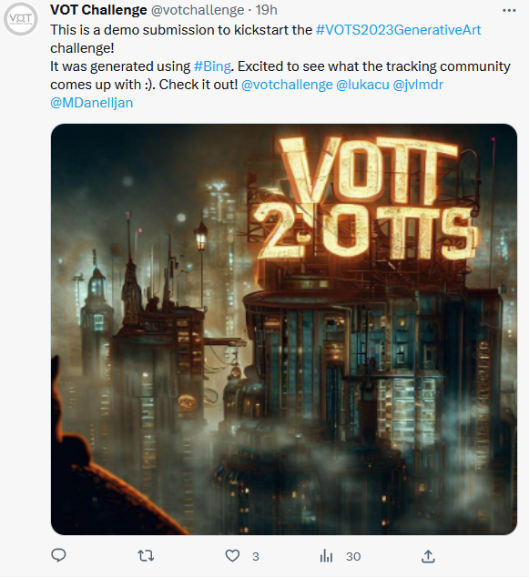

## VOTS2023 GenArt Challenge

Inspired by recent developments of generative art and to promote [VOT Twitter channel](https://twitter.com/votchallenge), we are introducing VOTS2023 GenArt, an exciting summer challenge for showcasing creativity and artistic flair of the tracking community. The challenge is open to everyone, including researchers, students, and practitioners.

Use generative art models to create images or video containing the VOTS2023 logo, or variations of it. The context is not restricted to tracking topics. The challenge seeks unconventional, mind-bending creations that defy the norm. The weirder and more innovative, the better!

You can view the submissions as they arrive on the VOT Twitter channel and are welcome to express appreciation by liking the submissions that resonate with you. We will also include the submissions on this page in the widget below (if the Twitter debugs their API).

### Winner identification

All submissions received on Twitter by **17th of September** will be considered. The VOTS2023 committee will carefully evaluate the submissions and exercise its discretion in selecting the winner. The winner will be announced at the VOTS2023 workshop on **3rd of October**.

There will be a small prize for the winner, but the main reward is the glory and fame of being the first VOTS Generative Art Challenge winner.

### How to participate

Follow these simple three steps:

1. Generate an image or video using a generative art engine of your choice.
2. Follow the VOT Twitter channel.
3. Post the image or video on Twitter with tagging three friends and @votchallenge, and add #VOTS2023GenerativeArt. Provide a few keywords on the generation tool or pipeline.

We will confirm reception of your submission by “liking” it, but it may take a few days.

### Submission examples

For inspiration, you can check the [VOT2022 Workshop coffee break montage](https://data.votchallenge.net/vot2022/coffee_break.mp4) made by [Vitjan Zavrtanik](https://vicos.si/people/vitjan_zavrtanik/) who finetuned the public Stable Diffusion model with 25 images of us wearing VOT t-shirts.

Example of the Twitter post to participate in this challenge:

### Important dates

- Challenge open: 20.7.2023
- Challenge closes: 17.9.2023
- Winner announcement: 3.10.2023

### FAQ

Q) Are there any restrictions on the tools used to generate?

A) No, you are free to use any tools -- online tools like Midjourney, Stable diffusion, etc., or your own trained-finetune image/video generation model.