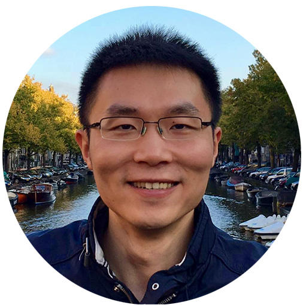

## Program

The workshop will take place on October 3rd (morning) 2023 @ICCV2023 in Paris.

8:30 - 10:00 **Session 1** 
* VOTS challenge outline & results
* *Keynote 1*: Jia Deng (topic tba)
* *Keynote 2*:  Adam Harley (topci tba)

10:00 - 10:30 **Coffee break**

10:30 - 12:00 **Session 2**
* VOTS winners talk
* VOTS runner-ups talk
* *Keynote 3*: Carl Vondrick (topic tba)
* *Keynote 4*: Fatma Güney (topic tba)  

12:00 - 12:30 **Session 3**
* Panel discussion & closing remarks

## Keynotes

[**Prof. Jia Deng**](https://www.cs.princeton.edu/~jiadeng/)

Jia Deng is an Associate Professor of Computer Science at Princeton University. His research focus is on computer vision and machine learning. He received his Ph.D. from Princeton University and his B.Eng. from Tsinghua University, both in computer science. He is a recipient of the Sloan Research Fellowship, the NSF CAREER award, the ONR Young Investigator award, an ICCV Marr Prize, and two ECCV Best Paper Awards.

[**Dr. Adam Harley**](https://adamharley.com/)

TBA

[**Dr. Carl Vondrick**](https://www.cs.columbia.edu/~vondrick/)

Carl Vondrick is an associate professor of computer science at Columbia University where he studies computer vision and machine learning. Previously, he was a Research Scientist at Google and he received his PhD from MIT in 2017 advised by Antonio Torralba. His research is supported by the NSF, DARPA, Amazon, Google, and Toyota, including the 2021 NSF CAREER Award

[**Prof. Fatma Güney**](https://mysite.ku.edu.tr/fguney/)

TBA

