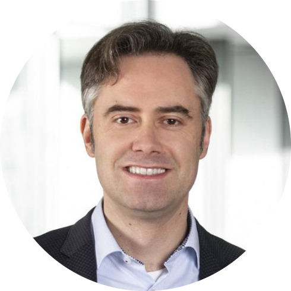
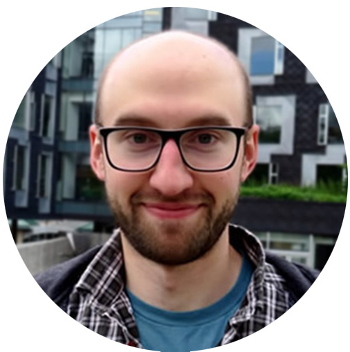
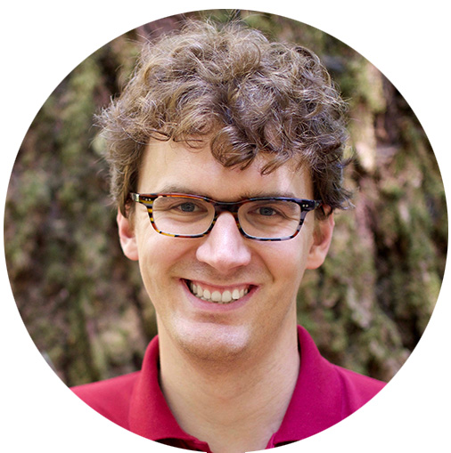
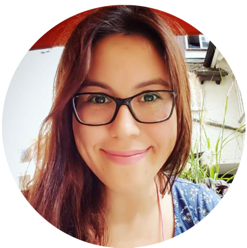

 
## Program
 
The workshop will take place on October 3rd (morning) 2023 @ICCV2023 in Paris.

8:45 - 10:15 Session 1 [Chair:Jiri Matas]

 * [08:45 - 08:50] Intro & hello (organizers)
 * [08:50 - 09:15] VOTS challenge outline & results (Matej Kristan)
 * [09:15 - 09:45] Keynote 1: Bastian Leibe
 * [09:45 - 10:15] Keynote 2: Adam Harley - Scaling Up Fine-Grained Tracking

10:15 - 10:45 Coffee break (30 min)

10:45 - 12:15 Session 2 [Chair: Martin Danelljan]

 * [10:45-11:15] Keynote 3: Carl Vondrick - Seeing through Occlusions with 3D World Representations
 * [11:15-11:30] VOTS winners talk: Yangming Cheng, Zongxin Yang, Yuanyou Xu, Xiaodi Li, Jiahao Li, Yi Yang, Yueting Zhuang, "DMAOT -- Decoupled Memory AOT"
 * [11:30-11:45] VOTS spotlight talk:Yinchao Ma, Wangkai Li, Dawei Yang, Rui Sun, Qianjin Yu, Fei Wang, Tianzhu Zhang, "DMNet -- Dynamic Matching Network"
 * [11:45-12:15] Keynote 4: Fatma Güney - Paying Attention to Temporal Axis in Unsupervised Object-Centric Learning

12:15 - 12:45 Session 3 [Chair: Hyung Jin Chang]

 * [12:15-12:40] Panel discussion (speakers)
 * [12:40-12:45] Closing remarks

## Keynotes
 

[**Prof. Bastian Leibe**](https://www.vision.rwth-aachen.de/person/1/)

Bastian Leibe is a Full Professor of Computer Science with RWTH Aachen University, Germany, where he leads the Computer Vision Group. He has published over 130 articles in peer-reviewed journals and conferences. His main research interests are in computer vision and machine learning for dynamic visual scene understanding, encompassing object recognition, tracking, segmentation, and 3D reconstruction. Over the years, he has received several awards for his research work, including the CVPR Best Paper Award in 2007, the DAGM Olympus Prize in 2008, and the U.V. Helava Award in 2012. He was awarded an European Research Council (ERC) Starting Grant in 2012, and an ERC Consolidator Grant in 2017. He has been a Program Chair for ECCV 2016 and an Area Chair and Program Committee Member for all major computer vision conferences.

[**Dr. Adam Harley**](https://adamharley.com/)

Adam is a postdoc at Stanford University, working with Leonidas Guibas. He recently completed his Ph.D. at The Robotics Institute at Carnegie Mellon University, where he worked with Katerina Fragkiadaki. His research interests lie in Computer Vision and Machine Learning, particularly for 3D understanding and fine-grained tracking. 

[**Dr. Carl Vondrick**](https://www.cs.columbia.edu/~vondrick/)

Carl Vondrick is an associate professor of computer science at Columbia University where he studies computer vision and machine learning. Previously, he was a Research Scientist at Google and he received his PhD from MIT in 2017 advised by Antonio Torralba. His research is supported by the NSF, DARPA, Amazon, Google, and Toyota, including the 2021 NSF CAREER Award.

[**Prof. Fatma Güney**](https://mysite.ku.edu.tr/fguney/)

Fatma Guney is an assistant professor of computer science at Koc University in Istanbul. She works on computer vision with a special focus on autonomous driving. Previously, she was a postdoc at VGG in Oxford and she received her PhD from Max Planck in 2017 advised by Andreas Geiger. Her research is supported by the ERC and the British Royal Society, including the 2023 ERC Starting Grant.

TBA

