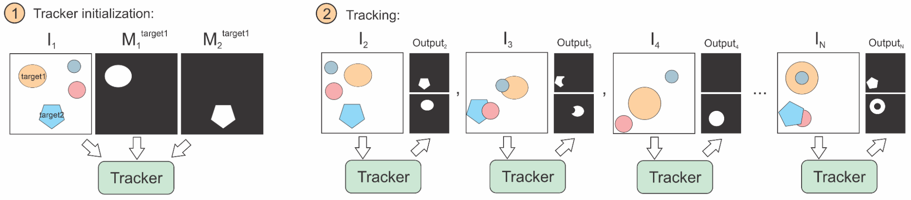
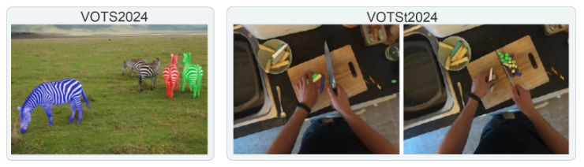
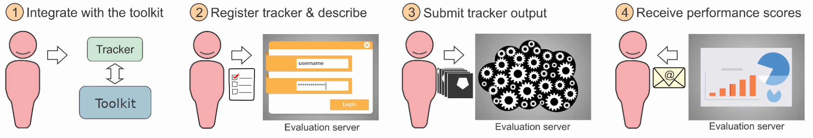

## Problem statement

VOTS adopts a general problem formulation that covers single/multiple-target and short/long-term tracking as special cases. The tracker is initialized in the first frame by segmentation masks for all tracked targets. In each subsequent frame, the tracker has to report all segmentation masks (one for each target). The following figure summarizes the tracking task.

Researchers are invited to participate in two challenges: **VOTS2024** and **VOTSt2024**. The difference between the two challenges is that VOTS2024 considers objects undergoing a topological transformation, such as vegetables cut into pieces, machines disassembled.

## VOTS2024 challenge participation

* Follow the guidelines to integrate your tracker with the [VOT toolkit](/howto/integration_multiobject.html) and [run the experiments](/howto/overview.html).
* Register your tracker on the VOTS2024 challenge registration page <TBA>, fill-out the tracker description questionnaire and submit the tracker description documents: a short description for the results paper and a longer description.
* Once registered, submit the output produced by the toolkit (see [tutorial](/howto/overview.html)) to the VOTS2024 challenge evaluation server <vots LINK TBA>. Do not forget to pack the results with the vot pack command.
* Receive performance scores via email.
* See Additional clarifications and FAQ below for further details.
* We invite the participants to run their trackers also on the VOTSt2024 challenge (see next section) – it’s zero-hassle once you’ve got the tracker running on the VOTS2024 challenge.

### Relevant datasets

 - The VOTS *development dataset* is composed of 4 sequences with each frame accompanied by a ground truth. This dataset is meant only for development purposes, i.e., to test your tracker integration, you can also test performance evaluation, but the scores are NOT official and have no significance due to small sequence count. To run your tracker on this dataset, create the workspace using command `vot initialize tests/multiobject` and follow the remaining of the instructions in the [toolkit overview tutorial](/howto/overview.html).

 - The *VOTS2024 competiton* dataset is the same as in VOTS2023 benchmark – composed of 144 sequences with ground truth only available at initialization frames. This dataset is downloaded automatically when using VOT toolkit and will be used for VOTS2024 tracker evaluation. Run your tracker on this dataset by creating a workspace using `vot initialize vots2024/main` in the toolkit and submit the output masks to the evaluation server. Note that you cannot run evaluation locally on your computer for this dataset, since the ground truth is only available on the evaluation server.

## VOTSt2024 challenge participation

* Follow the guidelines to integrate your tracker with the [VOT toolkit](/howto/integration_multiobject.html) and [run the experiments](/howto/overview.html).
* Register your tracker on the VOTSt2024 challenge registration page <TBA>, fill-out the tracker description questionnaire and submit the tracker description documents: a short description for the results paper and a longer description.
* Once registered, submit the output produced by the toolkit (see [tutorial](/howto/overview.html)) to the VOTSt2024 challenge evaluation server <TBA>. Do not forget to pack the results with the `vot pack` command.
* Receive performance scores via email.
* See Additional clarifications and FAQ below for further details.

### Relevant datasets

 - The *VOTSt2024 development dataset* is composed of validation sequences, accompanied with the annotations. This dataset is meant only for development purposes, i.e., to test your tracker integration, however, you can also run performance evaluation analysis. To run your tracker on this dataset, create the workspace using command `vot initialize vots2024/stval` and follow the remaining of the instructions in the toolkit overview tutorial. All videos are provided at 10fps.
 - The *VOTSt2024 competiton dataset* is based on [this paper](https://www.vostdataset.org/) and is used for evaluating trackers submitted to VOTSt2024. The dataset is downloaded automatically by the VOT toolkit. Run your tracker on this dataset by creating a workspace using `vot initialize vots2024/st` in the toolkit and submit the tracking results to the evaluation server. Note that you cannot run evaluation locally on your computer for this dataset, since the ground truth is only available on the evaluation server. All videos are provided at 10fps.

## Additional clarifications
 
 - The short tracker description should contain a concise description (LaTeX format) for the VOT results paper appendix (see examples in Appendix of a VOT results papers). The longer description will be used by the VOTS TC for result interpretation. Write the descriptions in advance to speed up the submission process.
 - Results for a single registered tracker may be submitted to the evaluation server at most 10 times, each at least 24h apart to mitigate overfitting attempts. In response to submissions >10, an email with Subject “Maximum number of VOTS submissions reached” will be sent to avoid confusion about the situation. Registering a slightly modified tracker to increase the number of server evaluations is prohibited. The VOTS committee reserves the discretion to disqualify trackers that violate this constraint. If in doubt whether a modification is “slight”, contact the VOTS committee.
 - Submissions resulting in evaluation error do not count into the limit on max submissions.
 - The results of the last submission will be taken into account and previous ones deleted. Make sure that the tracker code you link reproduces the last submission results.
 - When coauthoring multiple submissions with similar design, the longer description should refer to the other submissions and clearly expose the differences. If in doubt whether a change is sufficient enough, contact the organisers.
 - The participant can update information about the tracker (name, description, etc.) anytime before the challenge closes.
 - Only a single eu.aihub.ml account is allowed per tracker.
 - Authors are encouraged to submit their own previously published or unpublished trackers.
 - Authors may submit modified versions of third-party trackers. The submission description should clearly state what the changes were. Third-party trackers submitted without significant modification will not be accepted.
 - The VOTS2024 challenge winner is required to publicly release the pertained tracker and the source code. In case private training sets are used, the authors are strongly encouraged to make the dataset publicly available to foster results reproducibility.

### Tracker registration checklist (prepare in advance)

 - Make sure you selected the correct link depending whether you’re submitting to the VOTS2024 or the VOTSt2024 challenge.
 - Authors, affiliations + emails, and division of work.
 - Make sure that the tracker identifier in the manifest.yml (inside the results output zip file) match with the tracker short name you registered (in the registration form).
- Short tracker description for the results paper appendix. See examples in the [VOT2022 results paper](https://prints.vicos.si/publications/files/416). (~800 characters with spaces when compiled, which is ~1500 characters of LaTeX text without bibtex file)
 - Long tracker description (should detail the main ideas).
 - Bibtex file for the long and short tracker description.
 - A link to the tracker code placed in a persistent depository (Github, dropbox, Gdrive,…). If the link is not yet publicly accessible, provide a password. Note that to become a co-author of the results paper, the tracker has to be publicly accessible by the VOTS2024 workshop date.

### VOT restrictions on affiliations

As the VOT is primarily rooted in the EU, some members are restricted by law to collaborate with institutions from certain countries, such as the Russian Federation. Consequently the VOT cannot process submissions affiliated with the mentioned institutions. In such cases, the authors should consider declaring affiliations with internationally recognized professional organizations, such as IEEE, ACM, CVF or ORCHID instead. If uncertain about eligibility of your institution, please contact our [affiliation representative](mailto:michael.felsberg@liu.se).

## FAQ

  - **Does the number of targets change during tracking?**

    All targets in the sequence are specified in the first frame. During tracking, some targets may disappear and reappear later. The number of targets is different from sequence to sequence.

  - **Can I participate with a single-target tracker?**

    Sure, with a slight adjustment. You will write a wrapper that creates several independent tracker instances, each tracking one of the targets. To the toolkit, your tracker will be a multi-target tracker, while internally, you’re running independent trackers. See the examples [here](https://github.com/votchallenge/integration/blob/master/python/). 

  - **Can I participate with a bounding box tracker?**

    Sure, with a slight extension. In previous VOT challenges we showed that box trackers achieve very good performance on segmentation tasks by running a general segmentation on top of a bounding box. So you can simply run AlphaRef (or a similar box refinement module like SAM) on the top of your estimated bounding box to create the per-target segmentation mask. Running a vanilla bounding box tracker is possible, but its accuracy will be low (robustness might still be high). 

  - **Which datasets can I use for training?**

    Validation and test splits of popular tracking datasets are NOT allowed for training the model. These include: OTB, VOT, ALOV, UAV123, NUSPRO, TempleColor, AVisT, LaSOT-val, GOT10k-val, GOT10k-test, TrackingNet-val/test, TOTB.
    Other than above, training splits of any dataset is allowed (including LaSOT-train, TrackingNet-train, YouTubeVOS, COCO, etc.). For including the transparent objects, it is allowed to use the Trans2k dataset. In case private training sets are used, we strongly encourage making them publicly available for results reproduction. 

  - **Which performance measures are you using?**

    The VOTS2023 performance measures are used in both VOTS2024 and VOTSt2024 challenges, see the [VOTS2023 results paper](https://openaccess.thecvf.com/ICCV2023_workshops/VOTS).

  - **When will my results be publicly available?**

    The results for a registered tracker are revealed to the participant via an email in approximately 30 minutes after submission. Considering many requests, we decided to also reveal all results in the week after the challenge closes. The leaderboard data will contain also tracker registration details (without participants personal details, long tracker description and source code password). Note that public link to the source code is mandatory for the results paper coauthorship, but can be kept under password (revealed only to VOTS committee) until the VOTS workshop.
  
  - **Why is the analysis computed with the toolkit empty?**

    The VOTS2024 and VOTSt2024 evaluation datasets contain annotations for initialization frame only, which means that the analysis cannot be computed locally by the toolkit. Thus, the results should be submitted to the server, where analysis is computed and then reported to the user via email.

  - **If I submit several timest to the evaluation server, which submission will be used for the final score?**
    
    The **final submission** will be used for the final score. Please make sure that the tracker description matches the code that produced the final submission.

  - **Will the evaluation server remain open after the VOTS2023 deadline?**

    After the challenge deadline, the VOTS2024 and VOTSt2024 challenges become the VOTS2024 and VOTSt2024 benchmarks and the evaluation server will remain open. In fact, the VOTS2023 challenge results will be added to the VOTS2024 results. The results submission link on the challenge page will change to enable post-challenge submissions not included in the VOTS2024 results paper. However, all benchmark and challenge submissions will appear on the same leaderboard

 
 

<i class="glyphicon glyphicon-bullhorn hugeicon"></i> 

<h4>More questions?</h4>

Questions regarding the VOTS2023 challenge should be directed to the VOTS2023 committee. If you have general technical questions regarding the VOT toolkit, consult the FAQ page and the [VOT support forum](https://groups.google.com/g/votchallenge-help) first. Stay tuned with the latest VOT updates: Follow us on [Twitter](https://twitter.com/votchallenge). 

