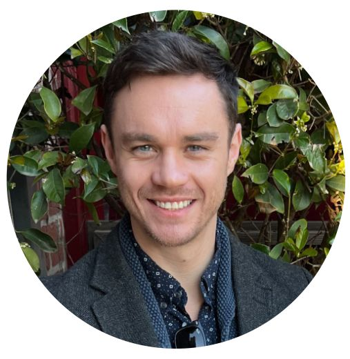
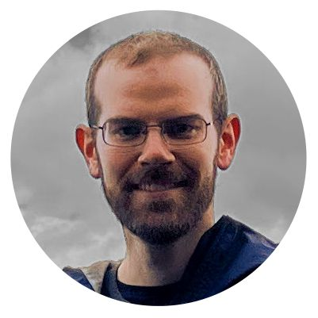

 
## Program

The workshop will take place on **September 29th (morning)** 2024 @ECCV2024 in Milano (room **Amber 4**). The VOTS2024 challenge results are available in the results paper [here](https://prints.vicos.si/publications/450).

**9:00 - 10:35 Session 1**

 * [9:00 - 9:05] Hello
 * [9:05 - 9:35] Keynote 1: Christoph Feichtenhofer - *SAM 2: Segment Anything in Images and Videos*
 * [9:35 - 9:55] VOTS2024 challenge results
 * [9:55 - 10:15] VOTST2024 challenge results
 
**10:15 - 10:35 Panel**

10:35 - 11:00 Coffee Break

**11:00 - 12:20 Session 2**

 * [11:00 -11:30] Keynote 2:  Carl Doersch - *Tracking Any Point for Robotics, Graphics, and Beyond*
 * [11:30 - 11:45] Winner of VOTS2024 presentation
 * [11:45 - 12:15] Keynote 3: Jia Deng - *Creating Synthetic Data for Tracking, Segmentation, and Everything Else*
 * [12:15 - 12:20] Closing remarks

## Keynotes

[**Dr. Christoph Feichtenhofer**](https://feichtenhofer.github.io/)

Christoph Feichtenhofer is a research scientist at Facebook AI Research (FAIR). Prior to joining Facebook in Spring 2018, he received the PhD degree in computer science from TU Graz, and spent time as a visiting researcher at the York University Toronto and the University of Oxford. He is the recipient of a DOC Fellowship of the Austrian Academy of Sciences and his PhD thesis was awarded with the Award of Excellence for outstanding doctoral thesis in Austria. His main areas of research include the development of effective representations for video understanding. He aims to find solutions for problems that are grounded in applications such as recognition and detection from video.

[**Dr. Carl Doersch**](http://www.carldoersch.com/)

Carl Doersch is a staff research scientist at DeepMind working closely with Andrew Zisserman. He completed his PhD in the Machine Learning Department at CMU, working with Alyosha Efros and Abhinav Gupta. He graduated from CMU in 2010 with a B.S. in computer science and cognitive science, with a minor in neural computation, completing an undergraduate thesis with Tai Sing Lee. He is interested in computer vision and all the learning problems that are associated with it. In particular, he is interested in self-supervised learning and transfer. In computer vision, the standard labels we use (e.g. bounding boxes, keypoint annotations) are not only expensive to collect, but they also tend to be a poor approximation to what we actually know about images. His work aims to learn better representations from real-world image and video structure like motion and context relationships on huge datasets, as well as synthetic data where ground truth can be obtained easily. This naturally leads to questions about how to transfer representations from self-supervised tasks to tasks of interest, as well as transferring knowledge from simulation to reality.

[**Assoc. Prof. Jia Deng**](https://www.cs.princeton.edu/~jiadeng/)

Jia Deng is an Associate Professor of Computer Science at Princeton University. His research focus is on computer vision and machine learning. He received his Ph.D. from Princeton University and his B.Eng. from Tsinghua University, both in computer science. He is a recipient of the Sloan Research Fellowship, the NSF CAREER award, the ONR Young Investigator award, an ICCV Marr Prize, and two ECCV Best Paper Awards.

