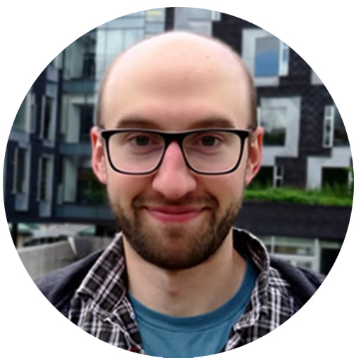
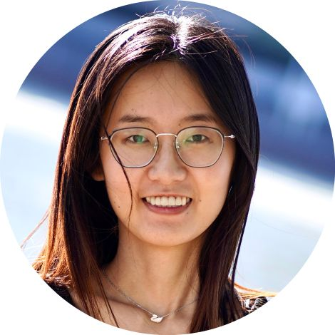
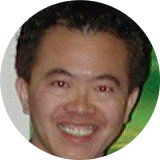
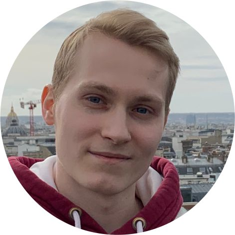

 
## Program

Date: **20th October (afternoon)**, ICCV2025, Hwaii, USA  
Room: TBA

**13:30 - 15:20 Session 1** (Chair: Jiri Matas)

 * [13:30 - 13:35] Hello
 * [13:35 - 14:05] Keynote 1: Adam Harley - *Challenges in Point Tracking: Density, 3D, and Data*
 * [14:05 - 14:30] VOTS2025 + VOTS-RT2025 challenge results: Matej Kristan
 * [14:30 - 14:50] Winner of VOTS2025 VOTS-RT2025: Ming-Hsun Yang  
 * [14:50 - 15:20] Keynote 2: Qianqian Wang  

15:20 - 15:50 Coffee Break *(30 min)*

**15:50 - 17:40 Session 2** (Chair: Hyung Jin Chang)

 * [15:50 - 16:20] Keynote 3: Ming Hsun Yang 
 * [16:20 - 16:35] VOTSt2024 challenge results: Pavel Tokmakov
 * [16:35 - 16:50] Winner of VOTSt2025: Ming Hsun Yang 
 * [16:50 - 17:20] Keynote 4: Nikita Karaev - *What's next for Point Tracking?*
 * [17:20 - 17:40] Panel: The future of VOTS, tracking and motion understanding 

## Keynotes

[**Dr. Adam Harley**](https://adamharley.com/)

Dr. Harley is a Research Scientist at Meta, working on computer vision and machine learning,  trying to get computers to understand motion and space. Before Meta, he did a postdoc with Prof. Leonidas Guibas at Stanford University, and a Ph.D. in Robotics at Carnegie Mellon University with Prof. Katerina Fragkiadaki. Before that, he did a Master of Science in computer science, with Prof. Kosta Derpanis. Even earlier, he did a Bachelor of Arts in psychology.

[**Dr. Qianqian Wang**](https://qianqianwang68.github.io/)

Dr. Wang is a postdoctoral researcher at UC Berkeley, working with Prof. Angjoo Kanazawa and Prof. Alexei A. Efros. She completed my PhD in Computer Science at Cornell Tech, Cornell University with my advisors Prof. Noah Snavely and Prof. Bharath Hariharan. Before that she received my bachelor's degree from Zhejiang University, working with Prof. Xiaowei Zhou.  Her current research focuses on understanding and modeling the dynamic 3D world from everyday images and videos. Her long-term research goal is to build intelligent systems that can perceive, understand and continually learn from the complex, ever-changing physical world. 

[**Prof. Ming-Hsun Yang**](https://faculty.ucmerced.edu/mhyang/)

Prof. Yang is affiliated with the University of California at Merced, Merced, CA, USA; Yonsei University, Seoul, South Korea; and Google, Mountain View, CA, USA. Dr. Yang is a fellow of the ACM. He received the NSF CAREER Award in 2012 and the Google Faculty Award in 2009. He served as the Program Co-Chair of the IEEE International Conference on Computer Vision (ICCV) in 2019, the Program Co-Chair of Asian Conference on Computer Vision (ACCV) in 2014, and the General Co-Chair of ACCV in 2016. He served as an Associate Editor for IEEE TRANSACTIONS ON PATTERN ANALYSIS AND MACHINE INTELLIGENCE from 2007 to 2011. He is an Associate Editor of International Journal of Computer Vision, Image and Vision Computing, and Journal of Artificial Intelligence Research.

[**Dr. Nikita Karaev**](https://nikitakaraevv.github.io/)

Dr. Karaev is a founder of Pixelwise AI, where he's building technology to train robots using internet-scale human data. Previously, he did a PhD at Meta AI and the Visual Geometry Group, University of Oxford, supervised by Christian Rupprecht, Natalia Neverova, and Andrea Vedaldi. Before my PhD, he completed an engineering program at École Polytechnique in  Paris.   

