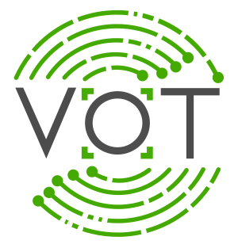

 
# VOTS2026 Challenge

 
Visual Object Tracking and Segmentation challenge VOTS2026 is a continuation of the VOTS2023 and VOTS2024 challenges, which no longer distinct between single- and multi-target tracking nor between short- and long-term tracking. It requires tracking one or more targets simultaneously by segmentation over long or short sequences, while the targets may disappear during tracking and reappear later in the video.

## Four challenges are organized

* VOTS2026 Challenge (Refreshed!) – Continuation of the VOTS2025 challenge with the task to track one or more general targets over short-term or long-term sequences by segmentation. The dataset is refreshed with new challenging sequences.
* VOTSt2026 Challenge – Continuation of the VOTSt2025 transformative object tracking challenge, which considers general objects undergoing a topological transformation, such as vegetables cut into pieces, machines disassembled, etc.
* VOTSp2026 Challenge (NEW!) – A new point-tracking challenge, which considers tracking several manually defined points. Challenging sequences have been selected to construct a new test set for his challenge.
* VOTSr2026 Challenge (NEW!) -- A new referring tracking challenge, with the task to segment objects in video based on descriptions.

## Important dates (tentative)

* **April 25, 2026** - All challenge details available on the website
* **May 13, 2026** - All challenges open
* **June 22, 2026** - Results submission deadline
* **July 13, 2026** - Winners announcement

## Sponsors

The VOTS2026 challenge is sponsored by the Faculty of Computer and Information Science, University of Ljubljana, The Academic and Research Network of Slovenia - ARNES, University of Birmingham, and Wallenberg AI - Autonomous Systems and Software Program WASP.

<i class="glyphicon glyphicon-bullhorn hugeicon"></i> 

<h4>Do you want to stay informed?</h4>

Subscribe to the new VOT mailing list by [sending an empty email](mailto:votchallange-join@lists.arnes.si) or follow us on [Twitter](https://twitter.com/votchallenge).

 