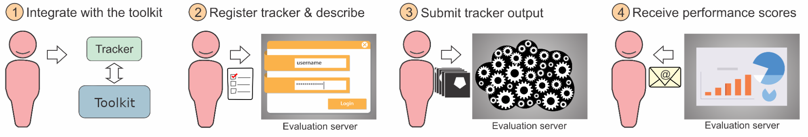

 
# Participation in VOTS2026 Challenge

Four challenges are offered in 2026: (i) VOTS2026 Challenge, (ii) VOTSt2026 Challenge, (iii) VOTSp2026 Challenge and (iv) VOTSr2026 Challenge.

Participation in any of the listed challenges requires following these steps:  
(i) Download the latest VOTS toolkit; (ii) Follow challenge-specific integration of the tracker; (iii) Run the evaluation by the toolkit; (iv) Register the tracker at the challenge-specific evaluation server; (v) Submit the raw results to the server and receive an email with performance scores.

During the challenge period, the results of the submissions will not be publicly available. The leaderboards will become visible after the results have been analyzed and winners announced.

In the following we provide guidelines for individual challenges and general participation rules. Please read through the "Tracker registration checklist" section at the bottom of this page in advance.

## VOTS2026 challenge participation

The task is to segment one or more objects, specified in the first frame of the video by a segmentation mask. The tracker is initialized in the first frame and reports the mask (one for each target) for each subsequent frame. The tracker can be run in two setups - either initializing and reporting masks for all objects or run separately for each object. We allow the latter integration, since many trackers are designed primarily for single-target tracking - the protocol is detailed in a separate section below.

**Participation steps:**

- Follow the guidelines to integrate your tracker with the [VOT toolkit](https://www.votchallenge.net/howto/integration_multiobject.html) and [run the experiments](https://www.votchallenge.net/howto/overview.html).
- Register your tracker on the VOTS2026 challenge registration page (link tba), fill out the tracker description questionnaire and submit the tracker description documents: a short description for the results paper and a longer description.
- Once registered, submit the output produced by the toolkit (see [tutorial](https://www.votchallenge.net/howto/overview.html)) to the VOTS2026 challenge evaluation server (link tba). Do not forget to pack the results with the vot pack command.
- Receive performance scores via email. In this challenge, the trackers will be evaluated on both 2025 and 2026 dataset, which are partially overlapping. To mitigate overfitting, you will receive only the VOTS2025 dataset scores, while the VOTS2026 dataset scores will be used to determine the winner and will be available at public leaderboard after the challenge period.
- We suggest submitting via Mozilla Firefox instead of Chrome browser to avoid issues with the submission system.
- See Additional clarifications and FAQ below for further details.
- We invite the participants to run their trackers also on the VOTSt2026 challenge (see next section) - it's zero-hassle once you've got the tracker running on the VOTS2026 challenge.

**Relevant datasets:**

- The VOTS _development dataset_ is composed of 4 sequences with each frame accompanied by a ground truth. This dataset is meant only for development purposes, i.e., to test your tracker integration, you can also test performance evaluation, but the scores are NOT official and have no significance due to small sequence count. To run your tracker on this dataset, create the workspace using command vot initialize tests/multi-object and follow the remaining of the instructions in the [toolkit overview tutorial](https://www.votchallenge.net/howto/overview.html).
- The _VOTS2026 competition_ dataset is derived from the VOTS2025 dataset by removing sequences tackled well by the current state of the art, and adding new challenging sequences, to widen the performance gap to sota. The toolkit will download the union of the VOTS2025 and VOTS2026 dataset and run your tracker. Run your tracker on this dataset by creating a workspace using vot initialize vots2026/main in the toolkit and submit the output masks to the evaluation server. Note that you cannot run evaluation locally on your computer for this dataset, since the ground truth is only available on the evaluation server. When submitted to the evaluation server, the results for VOTS2025 and VOTS2026 challenges will be computed. During the challenge period, the participants will receive only the VOTS2025 results, while the VOTS2026 results will be used to determine the winner and will be publicly available after the competition period.

#### **Simplifying integration of single-target trackers**

The VOTS sequences may contain several objects to be tracked. In the past, this required running several single-target tracker instances in parallel. To enable running also memory heavy trackers and to simplify integration, we introduce an option to run the experiment as "simultaneous" or "sequential" tracking. The simultaneous mode remains the same as previous year: a tracker is required to output predictions for all targets on an individual frame before starting to process the next frame. In the newly introduced sequential mode a tracker is run for each target independently, e.g., if a sequence has two targets, a tracker is initialized on the first and tracks it to the end of the sequence, then it is initialized on the second target and tracks it to the end of the sequence. Note that this mode is slower and requires more time to complete the experiment, but it simplifies a single-target tracker integration. You can see how these two modes are used in tracker integration: [simultaneous example](https://github.com/votchallenge/integration/blob/master/python/ncc_multiobject_mask.py) and [sequential example](https://github.com/votchallenge/integration/blob/master/python/ncc_singleobject_mask.py).

## VOTSt2026 challenge participation

The task is to segment an object, specified in the first frame of the video by a segmentation mask. The object breaks apart and/or substantially transforms throughout the sequence.

**Participation steps:**

- Follow the guidelines to integrate your tracker with the [VOT toolkit](https://www.votchallenge.net/howto/integration_multiobject.html) and [run the experiments](https://www.votchallenge.net/howto/overview.html).
- Register your tracker on the VOTSt2026 challenge [registration page](https://forms.gle/32okSSRfhbbg2t3Z8), fill-out the tracker description questionnaire and submit the tracker description documents: a short description for the results paper and a longer description.
- Once registered, submit the output produced by the toolkit (see [tutorial](https://www.votchallenge.net/howto/overview.html)) to the VOTSt2026 challenge evaluation server (link tba). Do not forget to pack the results with the vot pack command.
- Receive performance scores via email.
- We suggest submitting via Mozilla Firefox instead of Chrome browser to avoid issues with the submission system
- See Additional clarifications and FAQ below for further details.

**Relevant datasets**

- The _VOTSt2026 development dataset_ is composed of validation sequences, accompanied with the annotations. This dataset is meant only for development purposes, i.e., to test your tracker integration, however, you can also run performance evaluation analysis. To run your tracker on this dataset, create the workspace using command vot initialize vots2026/votstval and follow the remaining of the instructions in the toolkit overview tutorial. All videos are provided at 10fps.
- The _VOTSt2026 competition dataset_ is based on the paper [Breaking the "Object" in Video Object Segmentation](https://www.vostdataset.org/) (Tokmakov et al., CVPR 2023) and is used for evaluating trackers submitted to VOTSt2026 and for identifying the winner. The dataset is downloaded automatically by the VOT toolkit. Run your tracker on this dataset by creating a workspace using vot initialize vots2026/votst in the toolkit and submit the tracking results to the evaluation server. Note that you cannot run evaluation locally on your computer for this dataset, since the ground truth is only available on the evaluation server. All videos are provided at 10fps.

## VOTSr2026 challenge participation

The task is to segment an object throughout the video, specified by a referring expression.

**Participation steps:**

- Follow the [VOTSr2026 referral tutorial](https://www.votchallenge.net/howto/referral.html) to download the dataset, run your tracker on the (frames, text-prompt) pairs and format the predictions. The referral challenge does **not** integrate trackers with the toolkit through TraX — you run your tracker independently and submit its mask predictions.
- Register your tracker on the VOTSr2026 challenge [registration page](https://forms.gle/eVKQGqWNT5uU6U1E7), fill out the tracker description questionnaire and submit the tracker description documents: a short description for the results paper and a longer description.
- Once registered, pack your predictions with the `vot pack` command (see the [tutorial](https://www.votchallenge.net/howto/referral.html)) and submit the resulting zip to the VOTSr2026 challenge evaluation server (link tba).
- Receive performance scores via email.
- We suggest submitting via Mozilla Firefox instead of Chrome browser to avoid issues with the submission system
- See Additional clarifications and FAQ below for further details.

**Relevant datasets**

- The _VOTSr2026 development dataset_ is a small validation split with publicly available ground-truth masks, intended for testing your prediction pipeline locally. Create the workspace with `vot initialize vots2026/votsrval` and run `vot analysis <tracker>` to compute scores.
- The _VOTSr2026 competition dataset_ is based on the paper [ReferEverything: Towards Segmenting Everything We Can Speak of in Videos](https://refereverything.github.io) (Bagchi et al., ICCV 2025) and is used for evaluating trackers and identifying the winner of VOTSr2026. Run your tracker on this dataset by creating a workspace using `vot initialize vots2026/votsr` and submit the tracking results to the evaluation server. Note that you cannot run evaluation locally on your computer for this dataset, since the ground truth is only available on the evaluation server.
- **Training dataset restrictions:** While a validation split of the dataset is available on the [project web page](https://refereverything.github.io), it shouldn't be used for training. The entire dataset is meant for evaluation only.

## VOTSp2026 challenge participation

The task is to track several points throughout the video, each initialized by a 2D coordinate in the first frame.

**Participation steps:**

- Follow the guidelines to integrate your tracker with the VOT toolkit and run the experiments.
- Register your tracker on the VOTSp2026 challenge registration page (link tba), fill out the tracker description questionnaire and submit the tracker description documents: a short description for the results paper and a longer description.
- Once registered, submit the output produced by the toolkit (see [tutorial](https://www.votchallenge.net/howto/overview.html)) to the VOTSp2026 challenge evaluation server (link tba). Do not forget to pack the results with the vot pack command.
- Receive performance scores via email.
- We suggest submitting via Mozilla Firefox instead of Chrome browser to avoid issues with the submission system
- See Additional clarifications and FAQ below for further details.

**Relevant datasets**

- The _VOTSp2026 competition dataset_ is a curated multi-domain point tracking benchmark inspired by [AllTracker: Efficient Dense Point Tracking at High Resolution](https://arxiv.org/abs/2506.07310) (Harley et al., ICCV 2025), and is used for evaluating trackers and identifying the winner of VOTSp2026. Run your tracker on this dataset by creating a workspace using `vot initialize vots2026/votsp` in the toolkit and submit the tracking results to the evaluation server. Note that you cannot run evaluation locally on your computer for this dataset, since the ground truth is only available on the evaluation server.
- **Training dataset restrictions:** The VOTSp2026 benchmark is curated from the following datasets: EgoPoints, RoboTAP, AnimalTrack, BADJA, Cell Tracking Challenge, SpaceAnimal, DexYCB, CMU Panoptic, Horse-10, CTMCv1, CroHD, Ant Dataset, Tri-Mouse, I-MuPPET, Schooling-Fish. Training on any of these datasets is not allowed.

## Additional clarifications

- The short tracker description should contain a concise description (LaTeX format) for the VOT results paper appendix (see examples in Appendix of a VOT results papers). The longer description will be used by the VOTS TC for result interpretation. Write the descriptions in advance to speed up the submission process.
- Results for a single registered tracker may be submitted to the evaluation server at most 10 times, each at least 24h apart to mitigate overfitting attempts. In response to submissions >10, an email with Subject "Maximum number of VOTS submissions reached" will be sent to avoid confusion about the situation. Registering a slightly modified tracker to increase the number of server evaluations is prohibited. The VOTS committee reserves the discretion to disqualify trackers that violate this constraint. If in doubt whether a modification is "slight", contact the VOTS committee.
- Submissions resulting in evaluation error do not count into the limit on max submissions.
- The results of _the last submission_ will be kept and previous ones deleted. Make sure that the tracker code you link reproduces the last submission results.
- When coauthoring multiple submissions with similar design, the longer description should refer to the other submissions and clearly expose the differences. If in doubt a change is sufficient enough, contact the organizers.
- The participant can update information about the tracker (name, description, etc.) any time before the challenge closes.
- Only a single eu.aihub.ml account is allowed per tracker.
- Authors are encouraged to submit their own previously published or unpublished trackers.
- Authors may submit modified versions of third-party trackers. The submission description should clearly state what the changes were. Third-party trackers submitted without significant modification will not be accepted.
- The VOTS2026 challenge winner is required to publicly release the pertained tracker and the source code. In case private training sets are used, the authors are strongly encouraged to make the dataset publicly available to foster results reproducibility.

## Tracker registration checklist (prepare in advance)

- In registration/submission, make sure you select the correct link corresponding to your specific challenge.
- Write authors, affiliations + emails, and division of work.
- Make sure that the tracker identifier in the manifest.yml (inside the results output zip file) matches with the tracker short name you registered (in the registration form).
- Make your tracker short name composed of few letters (for sake of referencing in the results paper and performance plots) and keep in mind that the name will be formatted in Latex, thus avoid underscores, or write the name in Latex format.
  - Short tracker description for the results paper appendix. See examples in the [VOT2022 results paper](https://prints.vicos.si/publications/files/416). (~800 characters with spaces when compiled, which is ~1500 characters of LaTeX text without bibtex file)
- Long tracker description (should detail the main ideas).
- Bibtex file for the long and short tracker description.
- A link to the tracker code placed in a persistent depository (Github, dropbox, Gdrive,…). The link to the tracker repository must be provided at the time of tracker registration. It is author's obligation to make sure the link contains the tracker code by the challenge deadline. If the link is not yet publicly accessible, provide a password. Note that to become a co-author of the results paper, the tracker must be publicly accessible by the VOTS2026 workshop date.

## VOT restrictions on affiliations

As the VOT is primarily rooted in the EU, some members are restricted by law to collaborate with institutions from certain countries, such as the Russian Federation. Consequently, the VOT cannot process submissions affiliated with the mentioned institutions. In such cases, the authors should consider declaring affiliations with internationally recognized professional organizations, such as IEEE, ACM, CVF or ORCHID instead. If you are uncertain about eligibility of your institution, please contact our [affiliation representative](mailto:michael.felsberg@liu.se).

## VOTS2026 paper coauthorship

Participants whose trackers outperform the baselines in the respective challenges will be offered co-authorship of the results paper. The baselines are "STARK-multi" (VOTS2026), "RMem" (VOSt2026), "REM" (VOTSr2026), "AllTracker" (VOTSp2026).

## FAQ

- **Can I participate with a single-target tracker in VOTS2026?**

Sure, in fact, in the past years, most of top-performers were single-target trackers. Just use the simplified sequential mode (see example [here](https://github.com/votchallenge/integration/blob/master/python/ncc_singleobject_mask.py)).

- **Does the number of targets in VOTS2026/VOTSt2026 change during tracking?**

All targets in the sequence are specified in the first frame. During tracking, some targets may disappear and reappear later. The number of targets is different from sequence to sequence.

- **Can I participate with a bounding box tracker?**

Sure. We suggest prompting SAM3 with the bounding box output to obtain a segmentation mask. Reporting the bounding box is also acceptable, but this results in reduced localization accuracy measure.

- **Which datasets can I use for training?**

Validation and test splits of existing tracking datasets are NOT allowed for training. In case private training sets are used, we strongly encourage making them publicly available for results reproduction.

- **When will my results be publicly available?**

The results for a registered tracker are revealed to the participant via an email in approximately 30 minutes after submission, but are not available on the leaderboard. The leaderboard will be publicly available after results/winner announcement. Note that public link to the source code is mandatory for the results paper coauthorship, but can be kept under password (revealed only to VOTS committee) until the VOTS workshop.

- **If I submit several times to the evaluation server, which submission will be used for the final score?**

The **final submission** will be used for the final score. Please make sure that the tracker description matches the code that produced the final submission.

- **Will the evaluation server remain open after the VOTS2026 deadline?**

The server for 2026 challenges will close until results are announced, then it will re-open as 2026 benchmark.

  

<i class="glyphicon glyphicon-bullhorn hugeicon"></i> 

<h4>More questions?</h4>

Questions regarding the VOTS2025 challenge should be directed to the VOTS2025 committee. If you have general technical questions regarding the VOT toolkit, consult the FAQ page and the [VOT support forum](https://groups.google.com/g/votchallenge-help) first. Stay tuned with the latest VOT updates: Follow us on [Twitter](https://twitter.com/votchallenge). 

